# SPADEVizR: an R package for Visualization, Analysis and Integration of SPADE results.


<!--
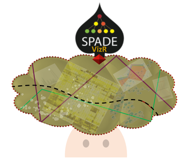
-->

# Table of Contents
1.  [Package overview](#package_overview)
2.  [Package installation](#package_installation)
3.  [Importing methods](#loading_data)
	1.  [Importing results from SPADE](#loading_SPADE_data)
	2.  [Importing results from other algorithms using FCS files](#loading_fcs)
	3.  [Importing results from other algorithms using CLR files](#loading_clr)
	4.  [Importing results from other algorithms using dataframes](#loading_other_data)
	5.  [Annotation of biological samples](#assignments)
4.  [Statistical methods](#stat_functions)
	1.  [Identification of clusters having an abundance greater than a specific value (Abundant Clusters)](#stat_function_identifyAC)
	2.  [Identification of clusters having an abundance different between two biological conditions (Differentially Abundant Clusters)](#stat_function_identifyDAC)
	3.  [Identification of clusters having an abundance correlated to a biological variable (Correlated Clusters)](#stat_function_identifyCC)
	4.  [Classification of clusters based on theirs abundance profiles](#stat_function_classify_abundance_profiles)
5.  [Visualization methods](#viewer_functions)
	1.  [Visualization of the number of cells associated to each cluster (Count Viewer)](#count_viewer_function)
	2.  [Visualization of combined SPADE trees (Tree Viewer)](#tree_viewer_function)
	3.  [Visualization of cell cluster phenotypes using a categorical heatmap (Heatmap Viewer)](#heatmap_viewer_function)
	4.  [Visualization of cell cluster phenotypes using parallels coordinates (Pheno Viewer)](#pheno_viewer_function)
	5.  [Visualization of cell cluster abundances in different biological conditions (Boxplot Viewer)](#boxplot_viewer_function)
	6.  [Visualization of cell cluster abundance kinetics in different biological conditions (Kinetics Viewer)](#kinetics_viewer_function)
	7.  [Visualization of cell cluster abundance dynamics in different samples (Streamgraph Viewer)](#streamgraph_viewer_function)
	8.  [Visualization of cell cluster or sample abundance similarities (MDS Viewer)](#MDS_viewer_function)
	9.  [Visualization of pairwise marker co-expressions (Distogram Viewer)](#distogram_viewer_function) 
	10.  [Visualization of co-expressions between two markers (Biplot Viewer)](#biplot_viewer_function)
6.  [Modeling methods](#model_functions)
	1.  [Prediction of biological outcomes using generalized linear models](#stat_function_prediction_glm)
	2.  [Prediction of biological outcomes using Cox proportional hazards regression models](#stat_function_prediction_cox)
	3.  [Prediction of biological outcomes using random forest models](#stat_function_prediction_rf)
7.  [Quality Control methods](#qc)
	1.  [Quantification of clusters having a small number of associated cells](#qc_small) 
	2.  [Quantification of clusters having uniform phenotypes](#qc_uniform_phenotypes) 
8.  [Exportation methods](#export)
9.  [Reporting methods](#report)
10.  [Miscellaneous functions](#misc)
	1.  [Merging of cell clusters](#misc_merge)
	2.  [Deletion of cell clusters](#misc_delete)
	3.  [Automatic annotation of cell clusters](#misc_annot)
11.  [SPADEVizR object structures](#object_structures)
	1.  [Overview of SPADEVizR objects](#object_structure_uml)
	2.  [Structure of a Results object](#object_structure_results)
	3.  [Structure of an AC object](#object_structure_AC)
	4.  [Structure of a DAC object](#object_structure_DAC)
	5.  [Structure of a CC object](#object_structure_CC)
	6.  [Structure of an AP object](#object_structure_AP)
12.  [Notes and discussion](#notes)
13.  [Bugs, contacts and additional features](#bugs)
14.  [Citation](#cite)
15.  [License](#license)
16.  [References](#references)

# <a name="package_overview"/> 1. Package overview

Cytometry is an experimental technique used to characterize cells at a single cell level.
The recent increase of measurable cell markers (up to 50 markers), thanks to mass [1] and hyperspectral cytometry [2], has led to the development of new computational approaches to identify groups of cells having similar expressions for selected markers.
Different automatic gating algorithms have been proposed such as SPADE [3], viSNE [4], ACCENSE [5] to identify these groups of cells, also named cell clusters.

Among them, the SPADE algorithm, which stands for spanning-tree progression analysis of density-normalized events, is a popular tool to analysis and explore mass-cytometry data.
This algorithm performs a density-based down-sampling combined with an agglomerative hierarchical clustering to identify the clusters of cells.
SPADE clustering results are generally displayed using a tree representation, where each node corresponds to a cell cluster and where similar clusters are linked using a minimal spanning tree approach. 
It is to note that SPADE clusters are labeled from 1 to n, where n corresponds to the total number of identified cell clusters.

In summary, SPADE works as the following: 

 1. All cytometry profiles (samples) of the dataset are down-sampled using a density-based approach and merged into a single matrix (containing cells from all samples);
 2. A hierarchical agglomerative clustering is performed to identify clusters of cells having similar expressions for selected markers (called clustering markers);
 3. A minimal spanning tree is built to represent the cell clusters and to link similar ones;
 4. An up-sampling procedure is performed to associate all cells of each sample to their closest cell cluster.

Contrary to many other computational approaches, the SPADE algorithm identify cell clusters having similar and homogenous phenotypes, within the whole dataset.
Consequently, cluster behaviors must be understood in terms of variation of cell abundance among samples rather than modifications of the cluster phenotypes.
The main advantage of this approach is to simplify the comparison of cluster characteristic between all samples.

SPADE results can be mainly summarized by two numeric matrices: 

 * The 'cluster abundances' matrix which contains the number of cell associated to each cluster for each sample;
 * The 'cluster phenotypes' matrix which contains the marker median expressions of each cluster for each sample.

SPADE offers new opportunities to explore high-dimensional cytometry data but additional statistical approaches and visualization features can improve the interpretation of the clustering results. 

SPADEVizR is an R package designed to provide deeper characterizations and interpretations of automatic gating results, especially provided by the SPADE algorithm.
SPADEVizR extends the original SPADE visualization outputs with viewer functions using techniques such as parallel coordinates, multidimensional scaling, volcano plots or streamgraph representations. 
All representations generated by SPADEVizR are created using the ggplot2 library [6] and can then be modified by the user.
Moreover, SPADEVizR is also able to generate reports evaluating the quality of the SPADE clustering results. 

For instance, categorical heatmaps and parallel coordinates can efficiently display the phenotypes of cell clusters.
Multidimensional scaling, streamgraph or distogram representations can also be used to provide overviews of similarities, dynamics and behaviors of cell clusters.
In addition, SPADEVizR can identify and visualize cell clusters with relevant biological behaviors.
This package allows identifying: 
(i) clusters having an abundance statistically greater than a specific threshold for a given condition; 
(ii) clusters having an abundance statistically different between two biological conditions; 
(iii) clusters having an abundance statistically correlated to a biological variable.
Statistical tests used to identify relevant clusters can be easily parameterized and p-value can be corrected for multiple testing.
Cell clusters can also be classified to identify those having similar abundance profiles in the dataset.

Moreover, SPADEVizR is able to construct generalized linear models, Cox proportional hazards models and random forest models based on the abundance of cell clusters. 
These models can be used to deeply analyze the cell clusters and can be used to predict biological outcomes in the various contexts including of survival studies.

The capabilities of our R package are illustrated using a public mass cytometry dataset [7].
In summary, this dataset consists in 15 samples and 25 cell markers, obtained in the context of a macaque vaccine study.
Five cynomolgus macaques have been vaccinated with the objective to compare the B cell responses at baseline, and 8 and 28 days after a second immunization (called "boost") with a modified vaccinia virus Ankara (recombinant HIV vaccine).
To illustrate SPADEVizR, we have performed a SPADE analysis on this dataset to identify 80 cell clusters using a down-sampling parameter of 35%.
Raw FCS files and the SPADE analysis results are available on a public ftp server: ftp://ftp.spadevizr.org/public/ (username: spadevizr, password: spadevizr).

SPADEVizR has been designed in a way that both biologists and bioinformaticians can interpret more easily the results provided by SPADE.
Moreover, SPADEVizR can be used with cell clustering results obtained from any automatic gating algorithm, as long as 'cluster abundances' and 'cluster phenotypes' matrices or FCS files can be provided.

SPADEVizR has five objects to handle the clustering results inputs and analysis results (`Results`, `AC`, `DAC`, `CC`, `AP` objects).
These objects are detailed in section 'SPADEVizR object structures' of this tutorial (#object_structures). 

# <a name="package_installation"/> 2. Package installation
The `data.table`, `diptest`, `ggdendro`, `ggfortify`, `ggplot2`, `ggRandomForests`, `ggrepel`, `gridExtra`, `gtable`, `gtools`, `igraph`, `MASS`, `packcircles`, `plyr`, `randomForestSRC`,`reshape2`, R packages as well as the `flowCore` [8] Bioconductor packages are required for running SPADEVizR. These packages can be installed using the following commands:

```r
install.packages('data.table')
install.packages('diptest')
install.packages('ggdendro')
install.packages("ggfortify")
install.packages('ggplot2')
install.packages('ggrepel')
install.packages('ggRandomForests')
install.packages('gridExtra')
install.packages('gtable')
install.packages('gtools')
install.packages('igraph')
install.packages('MASS')
install.packages('packcircles')
install.packages('plyr')
install.packages("randomForestSRC")
install.packages('reshape2')

source("http://bioconductor.org/biocLite.R")
biocLite(suppressUpdates = TRUE)
biocLite("flowCore", suppressUpdates = TRUE)
```

SPADEVizR is available on [GitHub](https://github.com), at https://github.com/tchitchek-lab/SPADEVizR. 
Its installation can be done via the `devtools` package using the following commands:

```r
install.packages('devtools')
library("devtools")
install_github('tchitchek-lab/SPADEVizR')
```

Once installed, SPADEVizR can be loaded using the following command:

```r
library("SPADEVizR")
```


# <a name="loading_data"/> 3. Importing methods

## <a name="loading_SPADE_data"/> 3.1. Importing results from SPADE
The `importResultsFromSPADE()` function  imports SPADE cell clustering results into a `Results` object.
This `Results` object contains the main information about the SPADE clustering results and can be further used by statistical and visualization functions. 

For instance, an import of a SPADE result can be done using the following command:

```r
# imports SPADE clustering results contained in the "./clustering_results.SPADE/" folder
results <- importResultsFromSPADE("./clustering_results.SPADE/")
```

Specific markers can be excluded during the import procedure by specifying their names to the `exclude.markers` parameter.
By default, four markers are excluded: "cell_length", "FileNum", "density", and "time".

The `quantile.approximation` parameter can be used to approximate the computation of marker range quantiles (set by default to `FALSE`). 
By this way, the importation of SPADE results will be more efficient in term of loading time and memory usage.

For instance, an import of a SPADE result by excluding the "cell_length", "FileNum", "density", "time", "beads140" and "Cells-(Ir191)Di" markers can be done using the following command:

```r
results <- importResultsFromSPADE("./clustering_results.SPADE/",
							      exclude.markers        = c("cell_length", "FileNum", "density", "time", "Beads", "Dead", "Cells-(Ir191)Di", "Cells-(Ir193)Di"))
## [START] - importing SPADE clustering results
## clustering_results.SPADE
## FCS files loading:
## 	archsin transform...
## 	compute quantiles bounds...
## 	reading SPADE results...
## Object class: Results
## Markers: 
## CD20
## CD69
## CD3
## CD38
## CD197
## HLADR
## CD14
## sIgM
## CD40
## CD62L
## CD27
## CD22
## Bcl-6
## CD45RA
## CD80
## Bcl-2
## CD279
## CD21
## CD195
## CD23
## sIgG
## CD95
## CD127
## TNF-a
## IL10
## Samples: 
## PBD08_BB078
## PBD08_BB231
## PBD08_BC641
## PBD08_BD619
## PBD08_BD620
## PBD28_BB078
## PBD28_BB231
## PBD28_BC641
## PBD28_BD619
## PBD28_BD620
## PPD00_BB078
## PPD00_BB231
## PPD00_BC641
## PPD00_BD619
## PPD00_BD620
## [END] - importing SPADE clustering results
```

As the contribution of samples having small number of cells can bias the cluster phenotypical characterization (visualized through the HeatmapViewer and the PhenoViewer), such contribution can be omitted in the import procedure using the `th.min_cells` parameter.

It is to note that a SPADE result can also be imported without loading any cluster phenotypes by setting `FALSE` to the `load.phenotype` parameter.

## <a name="loading_fcs"/> 3.2. Importing results from other algorithms using FCS files

The `importResultsFromFCS()` function imports cell clustering results from FCS files into a `Results` object. 
This function is especially useful for importing results from other algorithms, such as ViSNE or ACCENSE.

Each FCS file must contain marker expressions of each cell for one sample.
FCS files must contain a channel called "cluster" allowing to identify to which cluster each cell is associated.
The name of each file will be used as the name of the sample.

For instance, an import of cell clustering results, provided by such FCS files, can be done using the following command:

```r
# imports all FCS files contained in the "clustering_results.FCS" folder
results_fcs <- importResultsFromFCS("./clustering_results.FCS/")
## [START] - importing clustering results from FCS file
## clustering_results.FCS
## FCS files loading:
## 	archsin transform...
## 	compute quantiles bounds...
## 	extract results from FCS files...
## Object class: Results
## Markers: 
## Dead
## Beads
## CD20
## CD69
## CD3
## CD38
## CD197
## HLADR
## CD14
## IgM
## CD40
## CD62L
## CD27
## CD22
## Bcl-6
## CD45RA
## CD80
## Bcl2
## Ki67
## CD279
## IgD
## B5R
## CD21
## CD195
## CD23
## CD138
## IgG
## CD95
## CD127
## TNFa
## IL10
## Cells-(Ir191)Di
## Cells-(Ir193)Di
## Samples: 
## sample1
## sample2
## sample3
## [END] - importing clustering results from FCS file
```

As the contribution of samples having small number of cells can bias the cluster phenotypical characterization (visualized through the HeatmapViewer and the PhenoViewer), such contribution can be omitted in the import procedure using the `th.min_cells` parameter.


## <a name="loading_clr"/> 3.3. Importing results from other algorithms using CLR files

The `importResultsFromCLR.CSV()` and `importResultsFromCLR.ACS()` functions import cell clustering results from CLR files [9] into a `Results` object.
CLR files (which stand for 'CLassification Results files') can be in loaded as CSV or ACS file formats.
In CLR files, the association between the cells and the cell clusters are provided by probabilities scores.

CLR CSV files only contain the association between the cell and cell clusters.
CLR ACS files contain the CSV file and also the phenotypes of cells (and thereby the phenotypes of the cell clusters).

Each CLR CVSfile contains the associations between cells and cell clusters for one given biological sample.
The 'prob.th' parameter (set by default to `0.80`) defines the probability threshold from which a cell is considered to belong to a cell cluster.
Only the associations with the highest probabilities are considered to avoid cell belonging to multiple cell clusters.
The name of each file will be used as the sample name.

For instance, an import of cell clustering results, provided by such CLR CSV files, can be done using the following command:

```r
# imports all CLR CSV files contained in the "clustering_results.CLR-CSV" folder
results_clr.csv <- importResultsFromCLR.CSV("./clustering_results.CLR-CSV/")
## [START] - importing clustering results from a CLR CSV file
## clustering_results.CLR-CSV
## [END] - importing clustering results from CLR CSV files
## Object class: Results
## Markers: 
## 
## Samples: 
## sample1
## sample2
## sample3
## sample4
## sample5
```
It is to note that in the case of CLR CSV files, no cell cluster phenotypes will be imported and only some SPADEVizR viewers will be available.

Each ACS CLR file contains the associations between cells and cell clusters for one biological sample and contains the phenotype of each cell for one given biological sample.
The 'prob.th' parameter (set by default to `0.80`) defines the probability threshold from which a cell is considered to belong to a cell cluster.
Only the associations with the highest probabilities are considered to avoid cell belonging to multiple cell clusters.
The name of each file will be used as the sample name.

For instance, an import of cell clustering results, provided by such CLR ACS files, can be done using the following command:

```r
# imports all CLR ACS files contained in the "clustering_results.CLR-ACS" folder
results_clr.acs <- importResultsFromCLR.ACS("./clustering_results.CLR-ACS/")
## [START] - importing clustering results from a CLR ACS file
## clustering_results.CLR-ACS
## FCS files loading:
## [END] - importing clustering results from CLR ASC files
## Object class: Results
## Markers: 
## marker1
## marker2
## marker3
## marker4
## marker5
## marker6
## marker7
## marker8
## marker9
## marker10
## Samples: 
## example1
## example2
## example3
## example4
## example5
```


## <a name="loading_other_data"/> 3.4. Importing results from other algorithms using dataframes

The `importResultsFromTables()` function imports cell clustering results from dataframes into a `Results` object. 
This function takes 2 dataframes in parameters:

 * `cluster.abundances` is a dataframe containing the number of cells associated to each cluster for each sample. This dataframe must be formatted with the cluster names in rownames and the sample names in colnames as bellow: 

     x     | sample1 | sample2 | sample3 | ...
:---------:|:-------:|:-------:|:-------:|----
 cluster1  | 749     | 5421    |   8424  | ...
 cluster2  | 450     | 412     |   614   | ...
 cluster3  | 288     | 782     |   478   | ...
 ...       | ...     | ...     |   ...   | ...

 * `cluster.phenotypes` is a dataframe containing the marker median expressions of each cluster for each sample. This dataframe must be formatted as bellow:

sample   | cluster  | marker1  | marker2 | marker3 | ...
:-------:|:--------:|:--------:|:-------:|:-------:|-----
sample1  | cluster1 | 0.212    | 0.445   | 1.756   | ...
sample1  | cluster2 | 0.142    | 0.459   | 0.584   | ...
sample1  | cluster3 | 0.434    | 0.785   | 0.654   | ...
sample2  | cluster1 | 0.574    | 2.641   | 3.854   | ...
sample2  | cluster2 | 1.454    | 1.755   | -0.568  | ...
sample2  | cluster3 | 1.445    | 1.875   | -0.786  | ...
sample3  | cluster1 | 0.157    | 2.121   | 1.648   | ...
sample3  | cluster2 | 1.415    | 1.963   | 0.786   | ...
sample3  | cluster3 | 1.275    | 1.427   | 0.754   | ...
...      | ...      | ...      | ...     | ...     | ...

For instance, an import of a cell clustering result obtained from a specific automatic gating algorithm can be done using the following commands:

```r
cluster.abundances <- read.delim("./clustering_results.tables/cluster.abundances.txt", sep = "\t", stringsAsFactors = FALSE)
cluster.phenotypes <- read.delim("./clustering_results.tables/cluster.phenotypes.txt", sep = "\t", stringsAsFactors = FALSE)

head(cluster.abundances, n = 3)
##          sample1 sample2 sample3
## cluster1     749    5421    8424
## cluster2     450     412     614
## cluster3     288     782     478

head(cluster.phenotypes, n = 9)
##    sample  cluster marker1 marker2 marker3
## 1 sample1 cluster1   0.212   0.445   1.756
## 2 sample1 cluster2   0.142   0.459   0.584
## 3 sample1 cluster3   0.434   0.785   0.654
## 4 sample2 cluster1   0.574   2.641   3.854
## 5 sample2 cluster2   1.454   1.755  -0.568
## 6 sample2 cluster3   1.445   1.875  -0.786
## 7 sample3 cluster1   0.157   2.121   1.648
## 8 sample3 cluster2   1.415   1.963   0.786
## 9 sample3 cluster3   1.275   1.427   0.754

results_tables <- importResultsFromTables(cluster.abundances = cluster.abundances, cluster.phenotypes = cluster.phenotypes)
## [START] - importing cell clustering results
## 	loading cluster abundances...
## 	loading cluster phenotypes...
## 	computing minimal and maximal bounds...
## Object class: Results
## Markers: 
## marker1
## marker2
## marker3
## Samples: 
## sample1
## sample2
## sample3
## [END] - importing cell clustering results
```

As the contribution of samples having small number of cells can bias the cluster phenotypical characterization (visualized through the HeatmapViewer and the PhenoViewer), such contribution can be omitted in the import procedure using the `th.min_cells` parameter.


## <a name="assignments"/> 3.5. Annotation of biological samples

Contextual information can be associated to each biological sample contain in a `Results` object.
This assignment information is used by the different viewers to associate samples to specific biological conditions, time-points or individuals.
Such assignment can be done by providing a dataframe to the `Results` using the `assignContext()` method.
This dataframe must contain in each row a biological sample and in each column their associated biological condition ("bc" column), timepoint ("tp" column) and individual ("ind" column). 

For instance, such biological sample assignment can be done using the following commands:

```r
# assigns samples to theirs biological conditions and timpoints ("PPD00", "PBD08" and "PBD28") and to theirs individuals (BB078, BB231, BC641, BD619 and BD620)
assignments <- data.frame(row.names = c("PPD00_BB078", "PPD00_BB231", "PPD00_BC641", "PPD00_BD619", "PPD00_BD620", "PBD08_BB078", "PBD08_BB231", "PBD08_BC641", "PBD08_BD619", "PBD08_BD620", "PBD28_BB078", "PBD28_BB231", "PBD28_BC641", "PBD28_BD619", "PBD28_BD620"), 
						  bc = c("PPD00", "PPD00", "PPD00", "PPD00", "PPD00", "PBD08", "PBD08", "PBD08", "PBD08", "PBD08", "PBD28", "PBD28", "PBD28", "PBD28", "PBD28"), 
						  tp = c("PPD00", "PPD00", "PPD00", "PPD00", "PPD00", "PBD08", "PBD08", "PBD08", "PBD08", "PBD08", "PBD28", "PBD28", "PBD28", "PBD28", "PBD28"), 
						  ind = c("BB078", "BB231", "BC641", "BD619", "BD620", "BB078", "BB231", "BC641", "BD619", "BD620", "BB078", "BB231", "BC641", "BD619", "BD620"))

results <- assignContext(results, assignments = assignments)
## 3 column(s) have been found: bc, tp, ind
##                bc    tp   ind
## PPD00_BB078 PPD00 PPD00 BB078
## PPD00_BB231 PPD00 PPD00 BB231
## PPD00_BC641 PPD00 PPD00 BC641
## PPD00_BD619 PPD00 PPD00 BD619
## PPD00_BD620 PPD00 PPD00 BD620
## PBD08_BB078 PBD08 PBD08 BB078
## PBD08_BB231 PBD08 PBD08 BB231
## PBD08_BC641 PBD08 PBD08 BC641
## PBD08_BD619 PBD08 PBD08 BD619
## PBD08_BD620 PBD08 PBD08 BD620
## PBD28_BB078 PBD28 PBD28 BB078
## PBD28_BB231 PBD28 PBD28 BB231
## PBD28_BC641 PBD28 PBD28 BC641
## PBD28_BD619 PBD28 PBD28 BD619
## PBD28_BD620 PBD28 PBD28 BD620
```

Sample assignments can be discarded using a NULL assignment (`results@assignments <- NULL`)

# <a name="stat_functions"/> 4. Statistical methods

## <a name="stat_function_identifyAC"/> 4.1. Identification of cell clusters having an abundance greater than a specific value (Abundant Clusters)
*Abundant Clusters* are clusters having a cell abundance statistically greater than a given threshold in a specific set of samples. 
By this way, it is possible to identify clusters having a significant number of cells with a low variability across selected samples. 
These relevant clusters are identified using a one sample t-test (or a u-test) via the `identifyAC()` function.
In such approach, we model the abundances of each cluster by a normal distribution centered on their mean across the samples.
The t-test procedure is then used to test if the mean of this distribution is significantly different from a given value (`mu` which is set to 0 by default).
In non-parametric case, the u-test procedure is used to test if the median of the distribution differs from a given value (`mu` which is set to 0 by default).

The `identifyAC()` function returns an `AC` object which stores the main computation results about the Abundant Clusters (means, standard deviations, p-values).
This function takes a `Results` object as parameter and a character vector (`samples`) specifying the samples to use in the statistical computations. 
The calculations can be either based on relative abundance (percentages of cells relative to parent) or based on absolute abundance (number of cells) using the `use.percentages` parameter (TRUE by default).

Significant Abundant Clusters are characterized by two parameters: the theoretical mean or median value (`mu` parameter, set by default to `0`) and the p-value threshold (`th.pvalue` parameter, set by default to `0.05`).

For instance, the identification of clusters having an abundance statistically greater than 1% in some selected samples can be done using the following commands:

```r
# selects macaque samples at 8 days post-boost vaccination
samples   <- c("PBD08_BB078", "PBD08_BB231", "PBD08_BC641", "PBD08_BD619", "PBD08_BD620")

resultsAC <- identifyAC(results, samples = samples, mu = 1, th.pvalue = 0.01)
## [START] - Identification of Abundant Clusters
## Object class: Abundant Clusters (AC)
## Samples: 
## PBD08_BB078
## PBD08_BB231
## PBD08_BC641
## PBD08_BD619
## PBD08_BD620
## Used: relative abundances
## Number of identified AC: 16
## Statistical test used: t.test
## Adjusted method used: none
## Theorical value (mu): 1
## P-value threshold: 0.01
## [END] - Identification of Abundant Clusters
```

The returned `AC` object can be displayed to visualize, the identified Abundant Clusters using the `plot()` function. 
This representation displays the p-value (shown as -log10(p-value)) in the X-axis and the mean of cells abundance in the Y-axis, in a two-dimensional chart. 
Each dot in the representation corresponds to a cell cluster, and both p-value and mean thresholds are shown using red dashed lines. 
Abundant Clusters are highlighted in red and labeled. 
The size of the dots is proportional to the total number of associated cells in the considered samples.
The p-value and mean abundance thresholds are shown by dashed red lines

For instance, results contained in an `AC` object can be shown using the following command:

```r
# visualizes the identified Abundant Clusters stored in the AC object
plot(resultsAC)
```

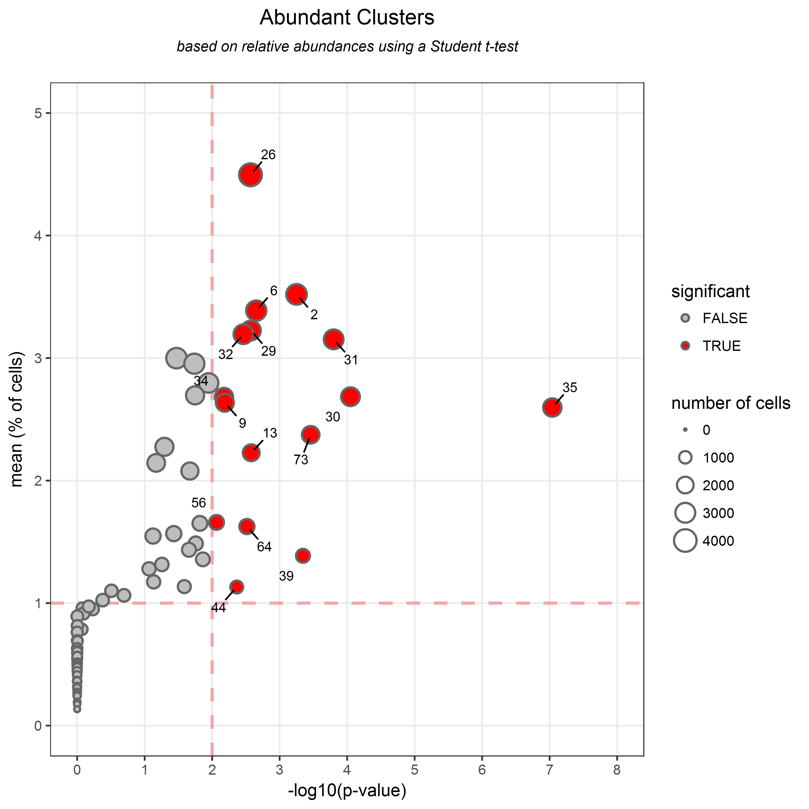

*This representation revealed that 16 clusters have been identified as Abundant Clusters, that is to say, clusters having an abundance statistically greater than 1% (p-value < 0.01).*

<!--
```
No language indicated, so no syntax highlighting. 
```
-->

## <a name="stat_function_identifyDAC"/> 4.2. Identification of cell clusters having an abundance different between two biological conditions (Differentially Abundant Clusters)
*Differentially Abundant Clusters* are clusters having a number of associated cells statistically different between two biological conditions.
By this way, it is possible to identify clusters having an abundance which evolves, in term of enrichment, between two biological conditions.
These relevant clusters are identified using a two samples t-test (or a u-test) via the `identifyDAC()` function.

In such approach, we model the abundances of each cluster by 2 normal distributions centered on the mean of the two conditions.
The t-test procedure is then used to test if the mean these 2 distributions are significantly different.
In non-parametric case, the u-test procedure is used to test if the rank distributions are different between the two conditions.
Differences between the two conditions are quantified using fold-changes.
The fold-change is defined as the ratio obtained by the mean of the first condition divided by the mean of the second condition.
If this ratio is below 1, then this ratio is transformed by its opposite inverse.

The `identifyDAC()` function returns a `DAC` object which stores the main computation results about the Differentially Abundant Clusters (means, standard deviations, fold-changes, p-values).
This function takes a `Results` object as parameter and two vectors (`condition1` and `condition2`) specifying the samples to consider in the two conditions. 
The calculations can either be based on relative abundance (percentages of cells relative to parent) or based on absolute abundance (number of cells) using the `use.percentages` parameter (TRUE by default).

Differentially Abundant Clusters are characterized by two thresholds: the fold-change threshold (`th.fc` parameter, set by default to `2`) and the p-value threshold (`th.pvalue` parameter, set by default to `0.05`).

For instance, the identification of differentially abundant clusters with a fold-change greater than 2 in the selected conditions can be done using the following commands:

```r
# selects macaque samples at 8 days post-boost vaccination
PBD08 <- c("PBD08_BB078", "PBD08_BB231", "PBD08_BC641", "PBD08_BD619", "PBD08_BD620")
# equivalent to 
PBD08 <- rownames(results@assignments[results@assignments$tp == "PBD08",])

# selects macaque samples at 28 days post-boost vaccination
PBD28 <- c("PBD28_BB078", "PBD28_BB231", "PBD28_BC641", "PBD28_BD619", "PBD28_BD620")
# equivalent to 
PBD28 <- rownames(results@assignments[results@assignments$tp == "PBD28",])

resultsDAC <- identifyDAC(results, condition1 = PBD08, condition2 = PBD28, th.pvalue = 0.05, th.fc = 2, method.paired = TRUE)
## [START] - Identification of Differentially Abundant Clusters
## Object class: Differentially Abundant Clusters (DAC)
## Samples of condition 1: 
## PBD08_BB078
## PBD08_BB231
## PBD08_BC641
## PBD08_BD619
## PBD08_BD620
## Samples of condition 2: 
## PBD28_BB078
## PBD28_BB231
## PBD28_BC641
## PBD28_BD619
## PBD28_BD620
## Used: relative abundances
## Number of identified DAC: 9
## Statistical test used: t.test
## Paired: TRUE
## Adjusted method used: none
## P-value threshold: 0.05
## Fold-change threshold: 2
## [END] - Identification of Differentially Abundant Clusters
```

This returned `DAC` object can be displayed to visualize, the identified Differentially Abundant Clusters, using the `plot()` function. 
This representation displays the p-value (shown as -log10(p-value)) in the Y-axis and the fold-change of cell abundances, in the X-axis in a two-dimensional chart. 
Each dot in the representation corresponds to a cell cluster, and both p-value and fold-change thresholds are shown using red dashed lines.
Differentially Abundant Clusters are highlighted in red and labeled.
The size of dots is proportional to the total number of associated cells in the 2 conditions merged.

By default, the fold-change is represented with a log2 transformation (which can be changed using the `fc.log2` parameter).

For instance, results contained in a `DAC` object can be shown using the following command:

```r
# visualizes the identified Differentially Abundant Clusters stored in the DAC object
plot(resultsDAC)
```

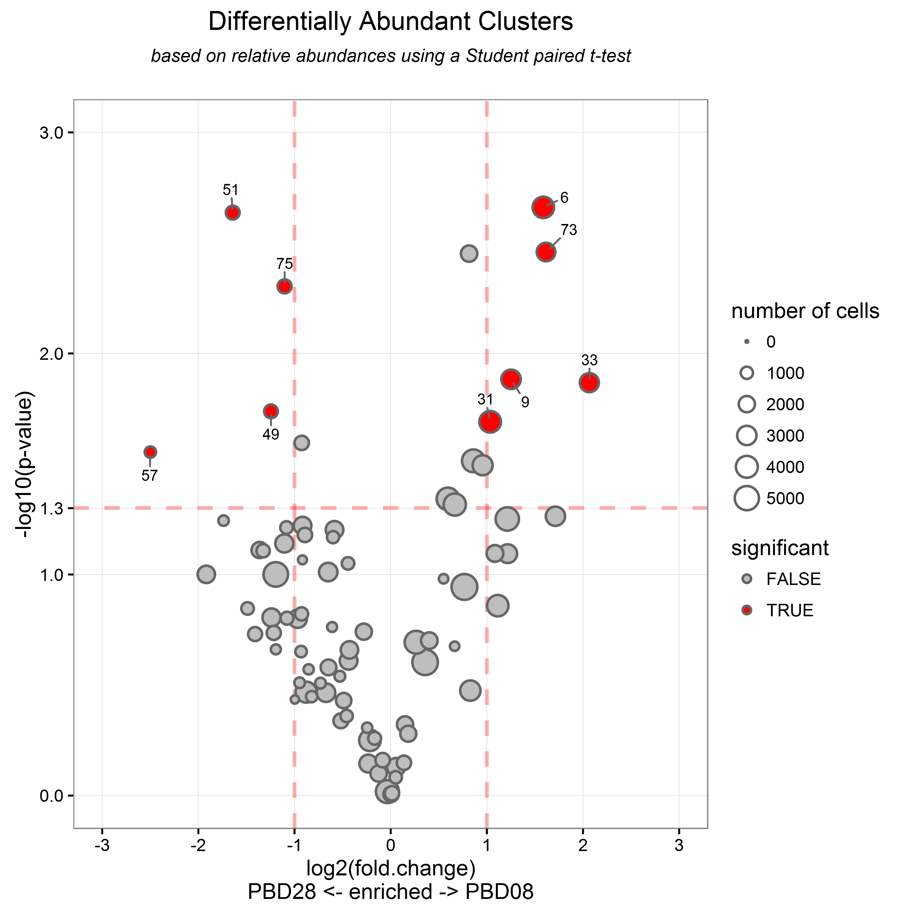

*This representation revealed that 9 clusters have been identified as Differentially Abundant Clusters, that is to say, clusters having an abundance statistically different between two biological conditions with a fold-change greater than 2 (p-value < 0.05).*

<!--
xxx
-->

## <a name="stat_function_identifyCC"/> 4.3. Identification of cell clusters having an abundance correlated with a biological variable (Correlated Clusters)
*Correlated Clusters* are clusters having a number of associated cells statistically correlated with a biological variable. 
By this way, it is possible to identify, clusters having an abundance evolving in the same manner (or in the opposite manner) as a biological variable across different samples.
These relevant clusters are identified using a Pearson correlation (or Spearman/Kendall correlation) via the `identifyCC()` function.
This function returns a `CC` object which stores the main computation results about the identification of Correlated Clusters (coefficients of correlation, p-values).

The `identifyCC()` function takes a `Results` object as parameter and a named numeric vector (`variable`) specifying the expression values of the biological variable for each sample. 
This named vector must provide correspondences between samples (in names) and expression values. 
The calculations can either be based on relative abundance (percentages of cells relative to parent) or based on absolute abundance (number of cells) using the `use.percentages` parameter (TRUE by default).
Significant Correlated Clusters are characterized by two thresholds: the absolute coefficient of correlation (R) threshold (`th.correlation` parameter, set by default to `0.7`) and the p-value threshold (`th.pvalue` parameter, set by default to `0.05`).

For instance, results contained in a `CC` object can be shown using the following command:

```r
# associates to each sample the serology of anti-MVA antibody
variable <- c("PPD00_BB078" = 50, "PPD00_BB231" = 50, "PPD00_BC641" = 50, "PPD00_BD619" = 50, "PPD00_BD620" = 50, "PBD08_BB078" = 32541, "PBD08_BB231" = 16769, "PBD08_BC641" = 16987, "PBD08_BD619" = 11592, "PBD08_BD620" = 7419, "PBD28_BB078" = 14621, "PBD28_BB231" = 7030, "PBD28_BC641" = 1048, "PBD28_BD619" = 3369, "PBD28_BD620" = 3881)
resultsCC <- identifyCC(results, variable = variable, th.correlation = 0.8, th.pvalue = 0.05)
## [START] - Identification of Correlated Clusters
## Object class: Correlated Clusters (CC)
## Samples = variables :
## PPD00_BB078 = 50
## PPD00_BB231 = 50
## PPD00_BC641 = 50
## PPD00_BD619 = 50
## PPD00_BD620 = 50
## PBD08_BB078 = 32541
## PBD08_BB231 = 16769
## PBD08_BC641 = 16987
## PBD08_BD619 = 11592
## PBD08_BD620 = 7419
## PBD28_BB078 = 14621
## PBD28_BB231 = 7030
## PBD28_BC641 = 1048
## PBD28_BD619 = 3369
## PBD28_BD620 = 3881
## 
## Used: relative abundances
## Number of identified CC: 1
## Statistical test used: pearson
## Adjusted method used: none
## P-value threshold: 
##  0.05
## Correlation threshold: 
##  0.8
## [END] - Identification of Correlated Clusters
```

This returned `CC` object can be displayed to visualize, the identified Correlated Clusters using the `plot()` function.
This representation displays the p-value (shown as -log10(p-value)) in the Y-axis and the correlation coefficient in the X-axis, in a two-dimensional chart.
Each dot in the representation corresponds to a cell cluster, and both correlation coefficient (positive and negative) and p-value thresholds are shown using red dashed lines. 
Correlated Clusters are highlighted in red and labeled. 
The size of dots is proportional to the total number of associated cells in the considered samples.

For instance, results contained in a `CC` object can be shown using the following command:

```r
# visualizes the identified Correlated Clusters stored in the CC object
plot(resultsCC)
```

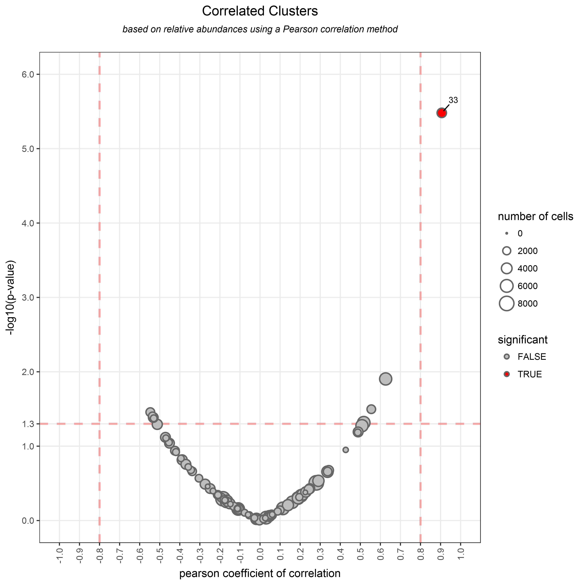

*This representation revealed that the cluster 33 has been identified as a Correlated Cluster, that is to say, a cluster having an abundance statistically correlated to a biological variable with a coefficient of correlation above 0.8 and p-value < 0.05.*

<!--
xxx
-->

## <a name="stat_function_classify_abundance_profiles"/> 4.4. Classification of cell clusters based on theirs abundance profiles
Cell clusters can be classified based on theirs *Abundance Profiles*, that is to say, based on the number of cells associated to each cluster for each sample.
The classification of those abundance profiles allows identifying groups of clusters having a similar behavior in term of abundance within the dataset.
These similar groups of cell clusters, called classes, can be identified using several classification methods via the `classifyAbundanceProfiles()` function.
This function returns an `AP` object which stores main computation results about the classes of these Abundance Profile (classification method, parameters, and classes).

The `classifyAbundanceProfiles()` function takes a `Results` objects as parameter and character (`method`) indicating the name of the clustering method to use. Parameter of the classification method can be specified using the `method.parameter` parameter.

Different methods are available to classify the cluster abundance profiles among:

 * `hierarchical_h` (by default):
This method performs a hierarchical clustering based on the Pearson correlation matrix of the cluster abundance profiles. 
The resulting dendrogram is cut at a specific height (a numeric value between 0 and 1, set by default to 0.7) to obtain the cluster groups. 
 * `hierarchical_k`:
This method also performs a hierarchical clustering based on the Pearson correlation matrix of the cluster abundance profiles.
The resulting dendrogram is cut in order to obtain the desired number of classes (a numeric integer). 
 * `k-means`: 
This method performs a k-means clustering of the cluster abundance profiles to obtained the desired number of classes (a numeric integer). 
 * `eigencell`:
This method performs an eigen vector decomposition and then calculate the correlations between cluster values and these eigen vectors.
Clusters which correlates with a coefficient higher than a specific threshold with the same eigen vector are classified together.
This correlation threshold (a numeric double between 0 and 1, set by default to 0.8) is provided using the `method.parameter` parameter.
 * `clique`:
This method computes the Pearson correlation matrix of abundance profiles and generates an undirected graph of correlation.
In this graph, an edge is drawn between two nodes if the correlation coefficient in the adjacency matrix is above a specific threshold. 
This correlation threshold (a numeric double between 0 and 1, set by default to 0.7) is provided using the `method.parameter` parameter.
Clique, which correspond to subgraph in which every two distinct vertices are adjacent, are identified by using a maximal clique algorithm ("largest.cliques" method of the igraph package)
After building the graph, the method identifies the largest cliques (subgraph in which every two distinct vertices are adjacent) which are considered as classes of nodes.

For instance, cell clusters abundance profiles can be classified via a k-means approach, using the following commands: 


```r
# performs a k-means clustering to identify 6 classes of abundance profiles
set.seed(42)
results_AP <- classifyAbundanceProfiles(results, method = "k-means", method.parameter = 6)
## [START] - computing classifyClusteringResults
## Object class: AP
## Number of class: 6
## Classification method used: k-means
## Parameter used = 6
## [END] - computing classifyClusteringResults
print(results_AP)
## Object class: AP
## Number of class: 6
## Classification method used: k-means
## Parameter used = 6
```

This returned `AP` object can be displayed to visualize the cluster of each identified Abundance profiles using the `plot()` function.
This representation displays groups of clusters of the same class as a colored circle packing (ordered based on the number of clusters). 
The size of the dots is proportional to the total number of associated cells to each cluster.

For instance, the previously created `AP` object can be displayed using the following commands:

```r
# visualizes the classified Abundance Profiles stored in the AP object
plot(results_AP)
```

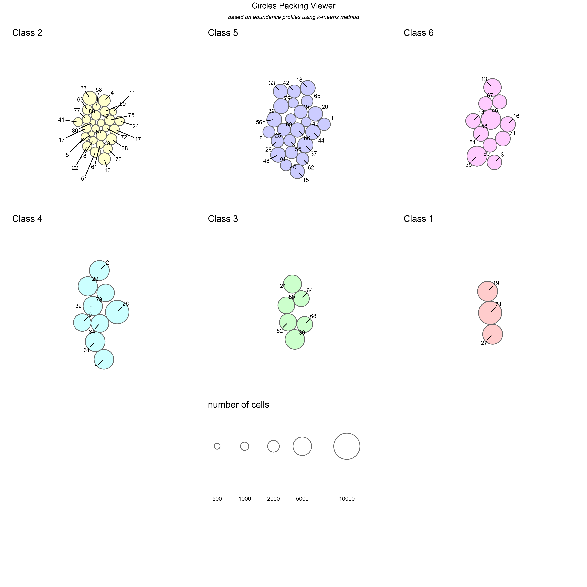

*Circle packaging representation showing groups of cell clusters having similar abundance profiles. The classification has been performed using a k-means partition method. This circle packing representation revealed that two main classes of abundance profiles can be identified. Four smaller classes can also be identified.*

<!--
xxx
-->

# <a name="viewer_functions"/> 5. Visualization methods

## <a name="count_viewer_function"/> 5.1. Visualization of the number of cells associated to each cluster (Count Viewer)
The *Count Viewer* aims to visualize the number of cells associated to each cluster. 
This representation displays the clusters in the X-axis and the total number of associated cells in the Y-axis.
Additionally, the numbers of cells associated to each cluster for each sample are also displayed using a jitter representation.
The size of the dots is proportional to the total number of associated cells. 

This representation can be displayed using the `countViewer()` function which takes a `Results` object as parameter. 
By default, all clusters will be displayed but the representation can be restricted to a set of selected samples (using the `samples` parameter) or to a set of selected clusters (using the `clusters` parameter).

For instance, the Count Viewer can be displayed using the following commands: 

```r
# selects macaque samples at 8 days post-boost vaccination
samples <- c("PBD08_BB078", "PBD08_BB231", "PBD08_BC641", "PBD08_BD619", "PBD08_BD620")
countViewer(results, samples = samples)
```

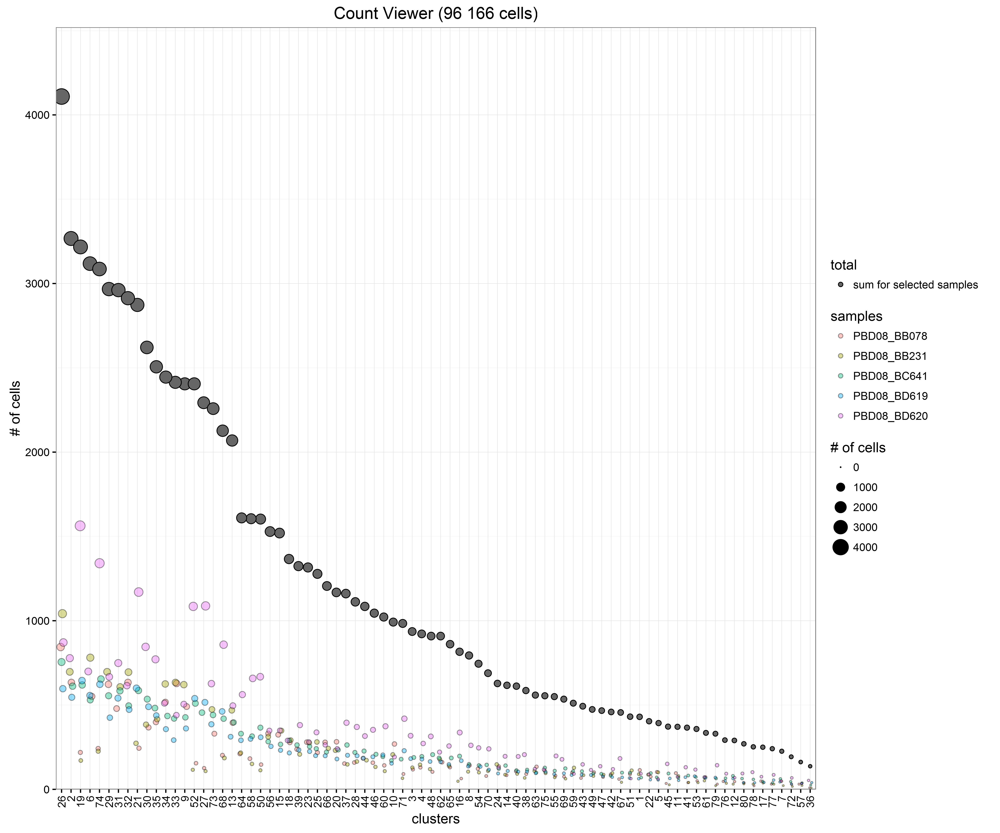

*Jitter representation showing the number of cells associated to each cluster of the dataset for a set of selected samples. Clusters are ordered based on their total number of associated cells*

<!--
xxx
-->

## <a name="tree_viewer_function"/> 5.2. Visualization of combined SPADE trees (Tree Viewer)
The *Tree Viewer* aims to visualize the SPADE tree representations. 
This representation displays the SPADE cell clusters using this minimal spanning tree layout computed by SPADE. 
In such tree, each node represents a cell cluster and nodes are linked based on theirs phenotype similarities.
This viewer improves the original SPADE tree representations by allowing to combine SPADE trees from multiple samples. 

This representation can be displayed using the `treeViewer()` function which takes a `Results` object as parameter. 
Significant clusters can be highlighted (node borders are then colored in blue) by providing an `AC`, `DAC`, or `CC` object (using the `highlight` parameter).
As with the original SPADE tree representations, nodes can be colored based on the marker median expression of a specific marker (using the `marker` parameter). 

For instance, a Tree Viewer can be displayed using the following commands:

```r
# selects macaque samples at 28 days post-boost vaccination, highlights previously DAC clusters and displays the expression of the HLADR marker
samples <- c("PBD28_BB078", "PBD28_BB231", "PBD28_BC641", "PBD28_BD619", "PBD28_BD620")
treeViewer(results, samples = samples, highlight = resultsDAC, marker = "HLADR")
```

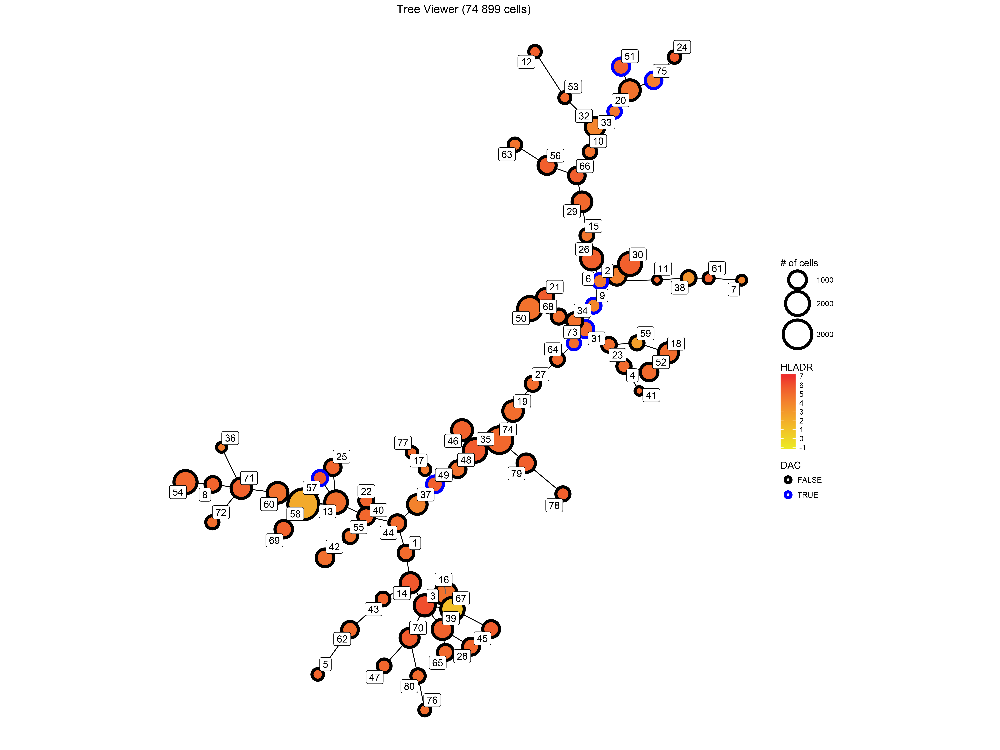

*Tree showing a combined SPADE tree using all samples of a given biological condition. Nodes are gradient-colored according to the expression of the "HLADR" marker. Nodes corresponding to Differentially Abundant Clusters have theirs borders colored in blue.*

It is to note that this function can only handle `Results` objects imported from SPADE results. 

<!--
xxx
-->


## <a name="heatmap_viewer_function"/> 5.3. Visualization of cell cluster phenotypes using a categorical heatmap (Heatmap Viewer)
The *Heatmap Viewer* aims to visualize the phenotypes of all cell clusters.
This representation displays marker expressions of all clusters using a categorical heatmap (5 categories are computed by default). 
The range expression of each cell marker is discretized in several categories between bounds of marker expressions.
Each marker of each cluster is then categorized into one category based on the mean of median marker expressions.
Markers used as clustering markers are shown in blue.

This representation can be displayed using the `heatmapViewer()` function and which takes a `Results` object as parameter. 
Both cell clusters and cell markers can be clustered using a hierarchical clustering (using the `dendrograms`, generating marker and cluster dendrograms by default).

It is to note that the Heatmap Viewer is the default viewer for `Results` objects.
This default viewer can be displayed using the `plot()` function.

For instance, a Heatmap Viewer can be displayed using the following command:

```r
# displays an heatmap representation summarizing phenotypes for the overall dataset
heatmapViewer(results)
```


```r
# equivalent to 
plot(results)
```

*Heatmap showing marker median relative expressions for all clusters. The mean of the median expression of each marker has been classified in 5 different categories. Hierarchical clustering has been performed at both the marker and cluster levels and are represented using dendrograms. Markers used by as clustering markers are shown in blue.*

If the `Results` object provided to this function is imported from SPADE results or FCS files then the bounds will correspond to the marker expression quantiles computed during the importation the results.
If the `Results` object provided to this function is imported from table results then the bounds will correspond to marker expression minimal and maximal values.

It is to note that samples having small number of cells (specified by the `th.min_cells` parameter in the import procedure) can be omitted in the computation and the representation. 

<!--
xxx
-->


## <a name="pheno_viewer_function"/> 5.4. Visualization of cell cluster phenotypes using parallels coordinates (Pheno Viewer)
The *Pheno Viewer* aims to visualize the phenotype of single cluster or a set of combined clusters.
This representation displays median marker expressions of each sample using parallel coordinates. 
In such viewer, each line corresponds to a biological sample and lines are positioned on a space where the X-axis represents the cell markers and the Y-axis represents the marker expressions. 
If biological conditions have been assigned to the biological samples, then samples belonging to the same condition will be shown using the same color.

This representation can be displayed using the `phenoViewer()` function which takes a `Results` object as parameter.
Marker expressions from several clusters can be combined by providing one or several cluster names to the `clusters` parameter.
In this case, the displayed marker expressions are the means of the median expressions for each cluster of each marker.

Markers used as clustering markers are shown in blue.
A dashed line indicates the mean marker expressions of all samples.
Importantly, a grey ribbon indicates the bounds of marker expressions in the overall dataset.
The visualization can be restricted to specific markers using the `markers` parameter.

For instance, a Pheno Viewer can be displayed using the following command:

```r
# displays the detailed cluster phenotype for cluster 33
phenoViewer(results, clusters = c("33"))
```

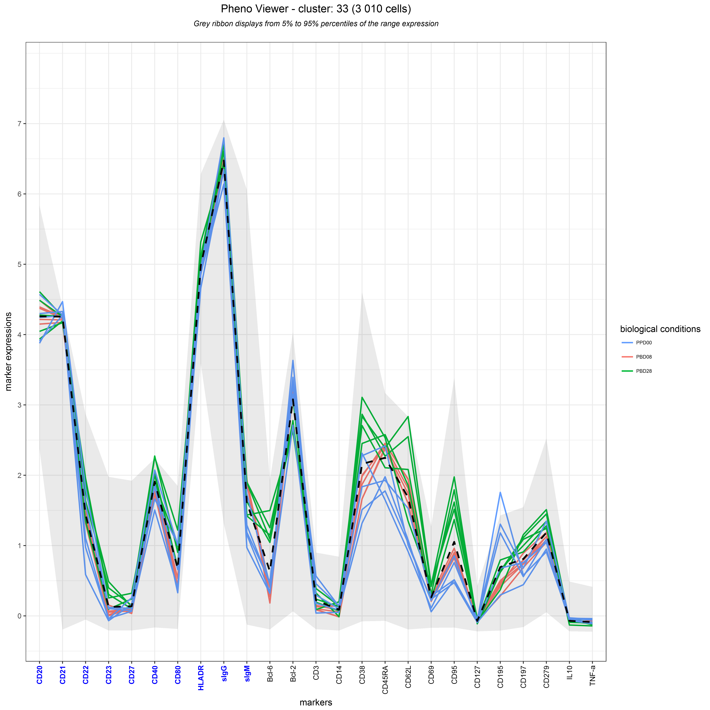

*Parallel coordinates showing the marker median expressions of each sample for a specific cluster (cluster 13). This representation helps to easily characterize the phenotype of a cluster (or a set of clusters) for all cell markers. In addition, this representation helps to easily estimate the homogeneity or heterogeneity of cluster phenotypes between all samples. The grey ribbon allows to easily evaluate marker expressions in regards to the overall marker expressions. Clustering markers are colored in blue and gathered on the left side*

If the `Results` object provided to this function is imported from SPADE results or FCS files then the bounds will correspond to the marker expression quantiles computed during the importation the results.
If the `Results` object provided to this function is imported from table results then the bounds will correspond to marker expression minimal and maximal values.

It is to note that samples having small number of cells (specified by the `th.min_cells` parameter in the import procedure) can be ted in the computation and the representation. 

<!--
xxx
-->


## <a name="boxplot_viewer_function"/> 5.5. Visualization of cell cluster abundances in different biological conditions (Boxplot Viewer)
The *Boxplot Viewer* aims to visualize and compare the abundances between several biological conditions for one single cluster or for a set of combined clusters.

This representation displays cell cluster abundances of each biological condition using boxplots.
Additionally, the abundance density of each biological condition can be visualize using violin representation.
Cluster abundance of each sample can also be visualized via colored dots.

This representation can be displayed using the `boxplotViewer()` function which takes a `Results` object as parameter.
Abundance from several clusters can be a by providing one or several cluster names to the `clusters` parameter.
Biological conditions information must be assigned to the samples in order to use this viewer (provided by the slot `assignments` in the `Results` object).
The cell cluster abundances could be displayed as percentages or absolute numbers using the `use.percentages` parameter (TRUE by default).

For instance, such representation can be generated using the following commands:

```r
# displays the abundance of the cluster 33 for all samples of each biological condition 
boxplotViewer(results, clusters = c("33"))
```

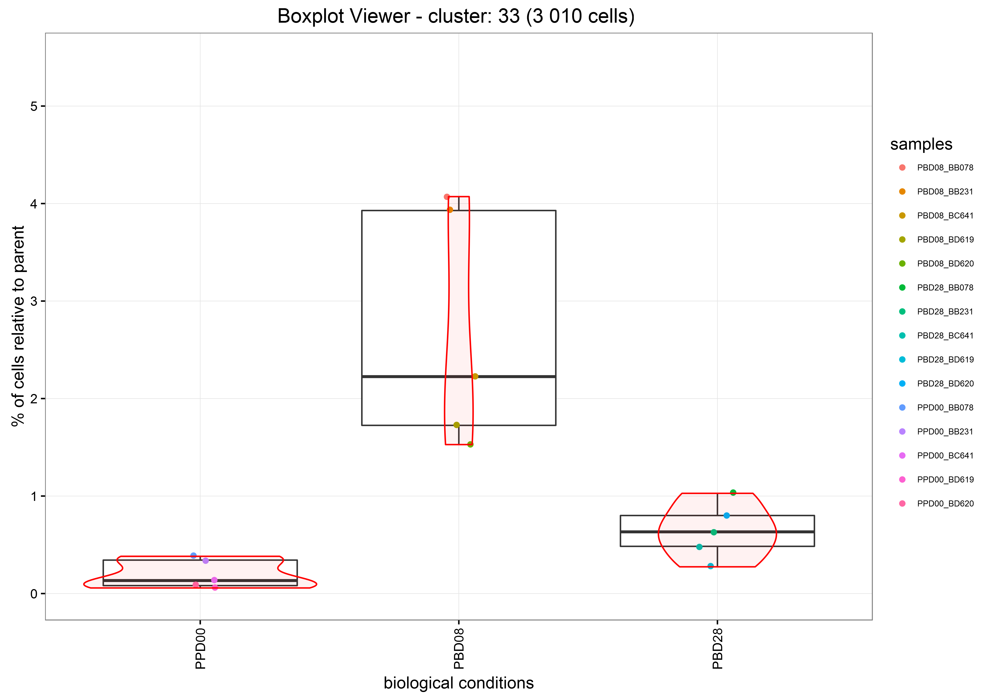

*Boxplot showing the abundance of the cluster 33 at baseline, 8 days after the post boost vaccination and 28 days after the post boost vaccination. For each condition the median (bold black line) and, the first and third quartiles (the 25th and 75th percentiles) of abundances are indicated.*

<!--
xxx
-->

## <a name="kinetics_viewer_function"/> 5.6. Visualization of cell cluster abundance kinetics in different biological conditions (Kinetics Viewer)
The *Kinetics Viewer* aims to visualize the cell cluster abundances in a kinetics manner. 
This representation displays the cell abundances over the time for each individual. 
Timepoints and indivuals information must be assigned to the samples in order to use this viewer (provided by the slot `assignments` in the `Results` object).
This representation can be displayed using the `kineticsViewer()` function which takes a `Results` object as parameter. 
The cell cluster abundances could be displayed as percentages or absolute numbers using the `use.percentages` parameter (TRUE by default).

For instance, such representation can be generated using the following command:

```r
# displays the abundance of the combined clusters 13 and 35 in a kinetic manner
kineticsViewer(results, clusters = c("51", "57"))
```

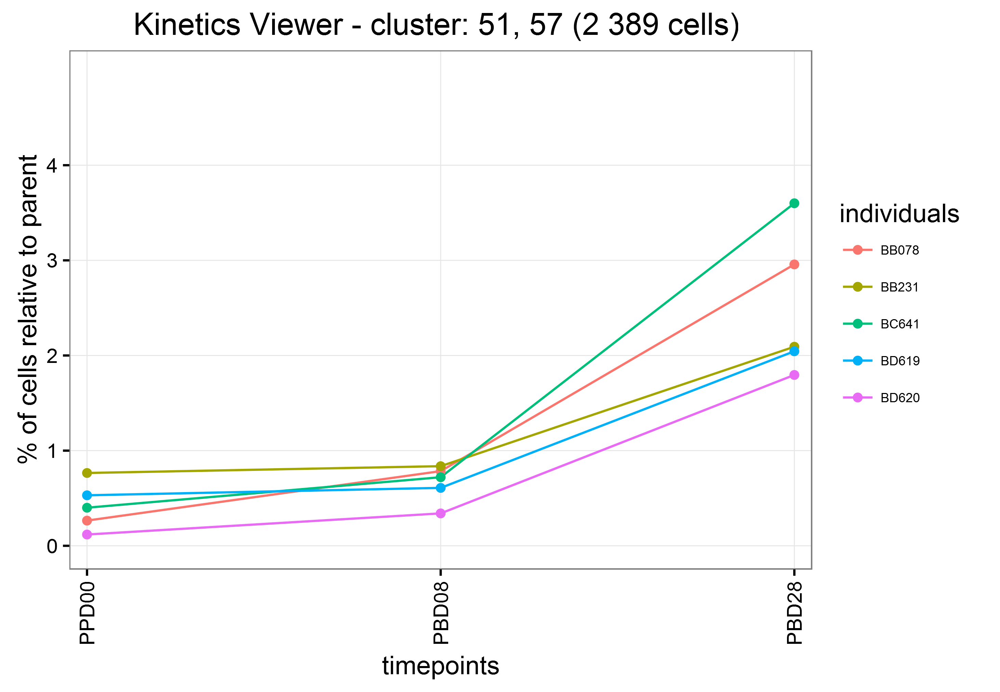

*Kinetics representation showing the abundance evolution of the combined clusters 13 and 35 for each individual across the 3 timepoints.*

## <a name="streamgraph_viewer_function"/> 5.7. Visualization of cell cluster abundance dynamics in different samples (Streamgraph Viewer)
The *Streamgraph Viewer* aims to visualize both absolute and relative abundance of clusters across the samples.
This representation displays cell abundances using a stacked area graph which is placed around a central axis.

This representation can be displayed using the `streamgraphViewer()` function which takes a `Results` object as parameter.
The cell clusters to visualize must be specified using the `clusters` parameter. 
Moreover, samples to be represented and their orders can be specified using the `samples` parameter.

For instance, such representation can be generated using the following command:

```r
# specifies a set of samples to use and their order in the representation
samples <- c("PPD00_BB078", "PPD00_BB231", "PPD00_BC641", "PPD00_BD619", "PPD00_BD620", "PBD08_BB078", "PBD08_BB231", "PBD08_BC641", "PBD08_BD619", "PBD08_BD620", "PBD28_BB078", "PBD28_BB231", "PBD28_BC641", "PBD28_BD619", "PBD28_BD620")
# displays the relative abundances of the selected set of clusters following the order previously defined
clusters <- c("7","12","19","21","33","44","48","49","50","55","68","69","75","76","78","79","80")
streamgraphViewer(results, samples = samples, clusters = clusters)
```

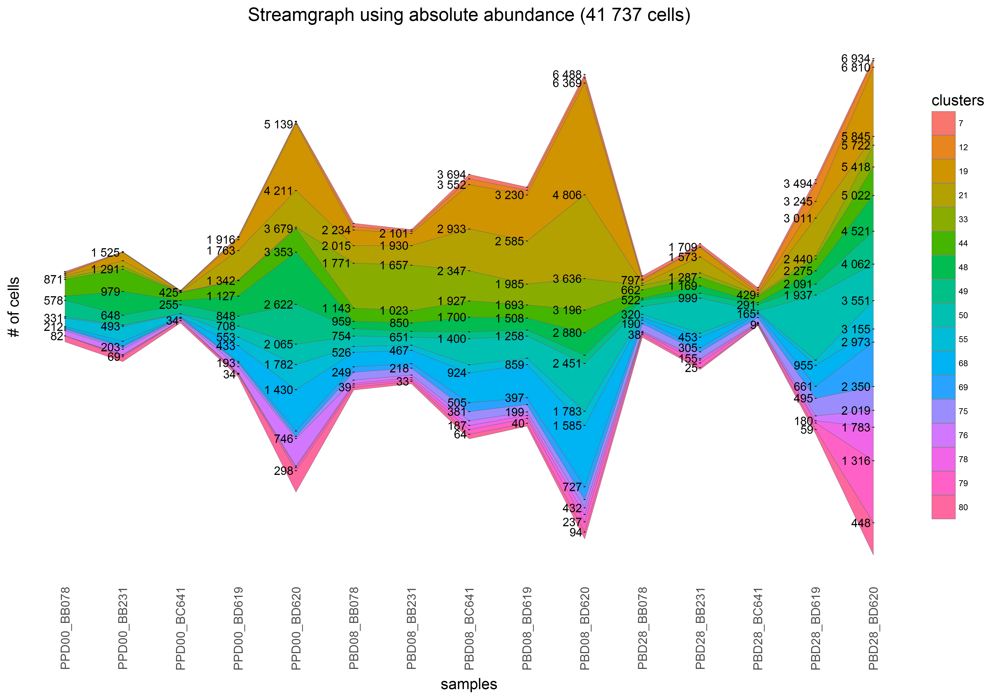

*Streamgraph showing absolute abundances for a set of specific clusters across all the samples. Samples are ordered in a way that each triplet of samples corresponds to individuals at baseline, 8 days after the post boost vaccination and 28 days after the post boost vaccination.*


```r
# The same could be done in a relative manner using the `use.relative = TRUE` parameter
clusters <- c("7","12","19","21","33","44","48","49","50","55","68","69","75","76","78","79","80")
streamgraphViewer(results, samples = samples, clusters = clusters, use.relative = TRUE)
```

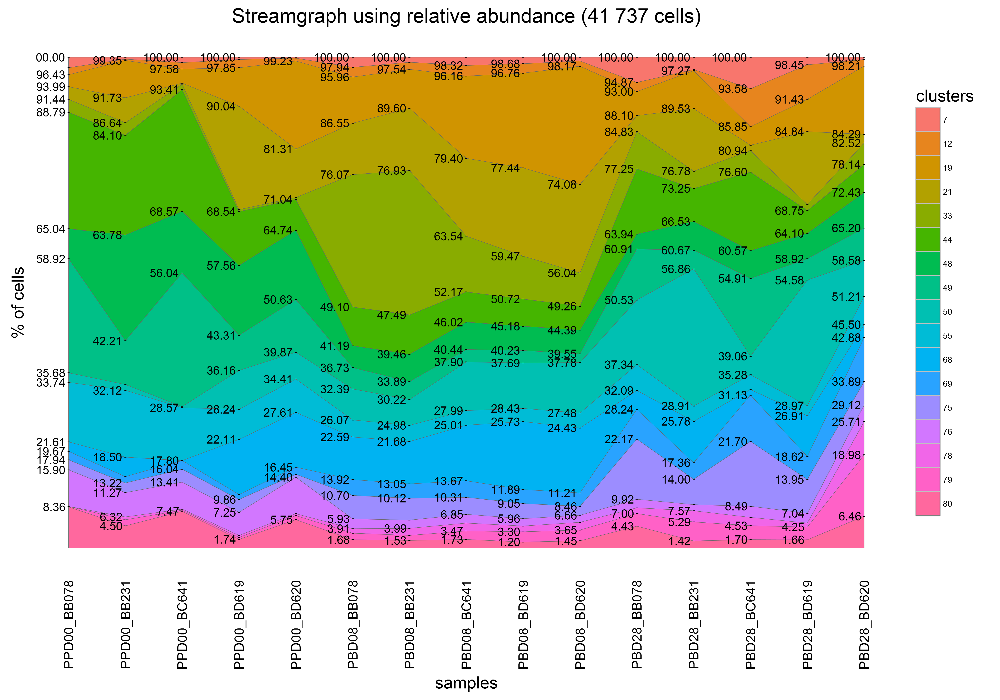

*The same representation using relative abundances*

<!--
xxx
-->

## <a name="MDS_viewer_function"/> 5.8. Visualization of cell cluster or sample abundance similarities (MDS Viewer)
Multidimensional Scaling (MDS) methods aim to represent the similarities and differences among high-dimensional objects into a space of a lower number of dimensions, generally in two or three dimensions for visualization purposes [10].
In MDS representations, the Kruskal Stress (KS) indicates the percentage of information lost during the dimensionality reduction process.

The *MDS Viewer* aims to visualize the similarities between samples or clusters based on their abundances. 
In such representation, each dot represents a sample or a cluster and the distances between the dots are proportional to the Euclidean distance between these objects.

This representation can be displayed using the `MDSViewer()` function which takes a `Results` object as parameter.
The representation space can be specified using the `space` parameter  ("samples" or "clusters").
In the case of "samples" space, biological conditions information can be assigned to the samples (provided by the slot `assignments` in the `Results` object).
This parameter must be a dataframe with sample names in row names and 2 other columns specifying the biological conditions and individuals. 


```r
# displays the similarities between all samples based on the selected cluster abundances
clusters <- c("6","7","9","12","18","19","21","31","33","44","48","49","50","51","53","55","57","59","68","69","72","73","75","76","78","79","80")
MDSViewer(results, space = "samples", clusters = clusters)
```

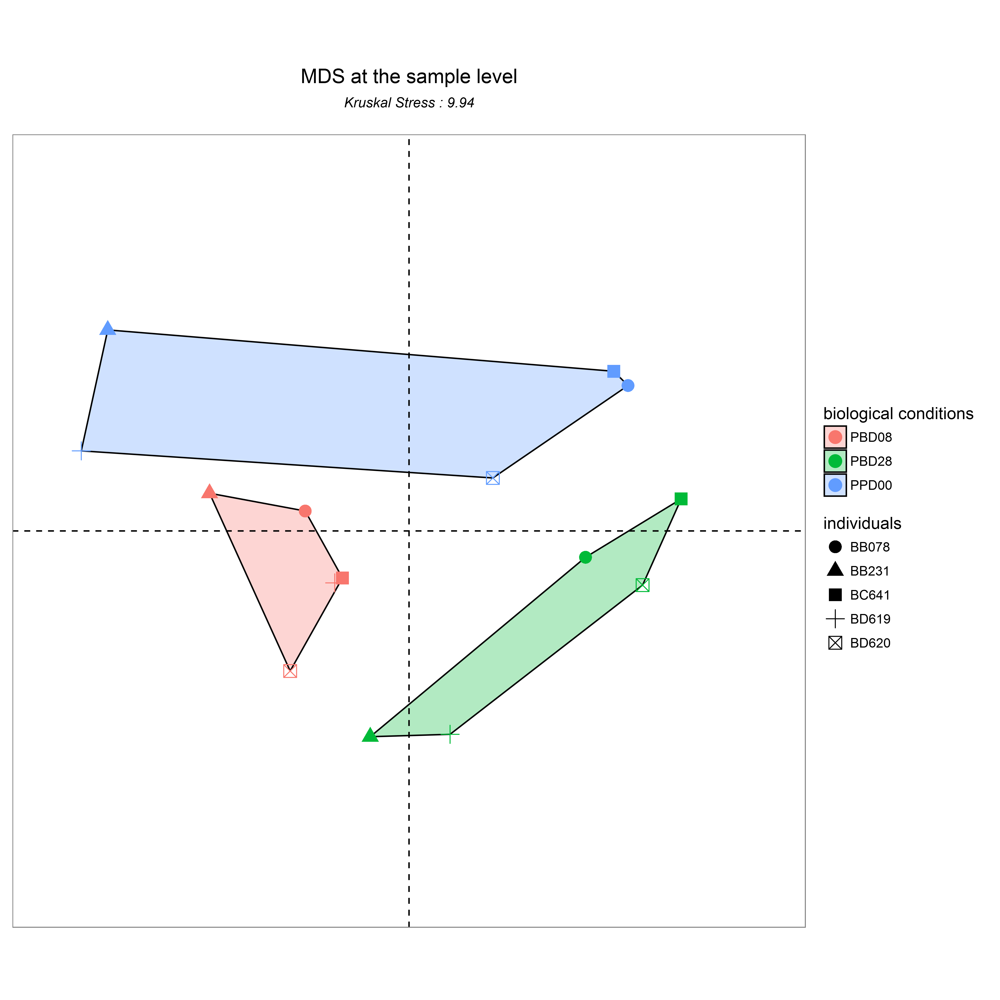

*MDS representation showing the similarities between selected samples. In such representation, each dot represents a sample and the distance between the dots are proportional to the Euclidean distance between these objects. Samples of the same biological condition are surrounded and colored together. It can be inferred from this MDS representation, that the three distinct conditions are, as expected, correctly segregated.*

For instance, such representation can be generated using the following command:

```r
# displays the similarities between the selected clusters
clusters <- c("6","7","9","12","18","19","21","31","33","44","48","49","50","51","53","55","57","59","68","69","72","73","75","76","78","79","80")
MDSViewer(results, space = "clusters", clusters = clusters)
```

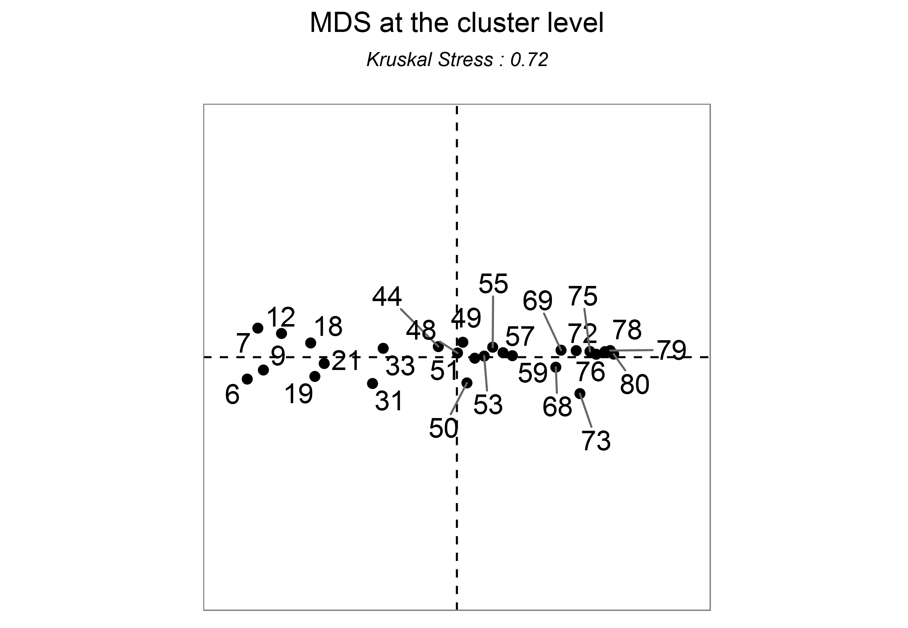

*MDS representation showing the similarities between a set of selected clusters. In such representation, each dot represents a cluster and the distance between the dots are proportional to the Euclidean distances between these objects. It can be inferred from this MDS representation, that two distinct groups contain clusters having a similar abundance evolution in the dataset.*

<!--
xxx
-->

## <a name="distogram_viewer_function"/> 5.9. Visualization of pairwise marker co-expressions (Distogram Viewer)
The *Distogram Viewer* aims to visualize the pairwise co-expressions between all markers using a distogram representation. 
In such representation, each tile corresponds to the co-expression between 2 markers and is gradient-colored based on the Pearson correlation between those 2 markers.
Markers used as clustering markers are shown in blue.

This representation can be displayed using the `distogramViewer()` function which takes a `Results` object as parameter. 
The visualization can be restricted to specific clusters, samples and markers by using respectively the `clusters`, `samples` and `markers` parameters.

For instance, such distogram representation can be generated using the following commands:

```r
# specifies a set of samples to use
samples  <- c("PBD08_BB078", "PBD08_BB231", "PBD08_BC641", "PBD08_BD619", "PBD08_BD620")
# specifies a set of clusters to use
clusters <- c("20","32","33","51")
# displays a distogram representation showing all marker co-expressions filtered by the selected samples and clusters
distogramViewer(results, samples = samples, clusters = clusters)
```

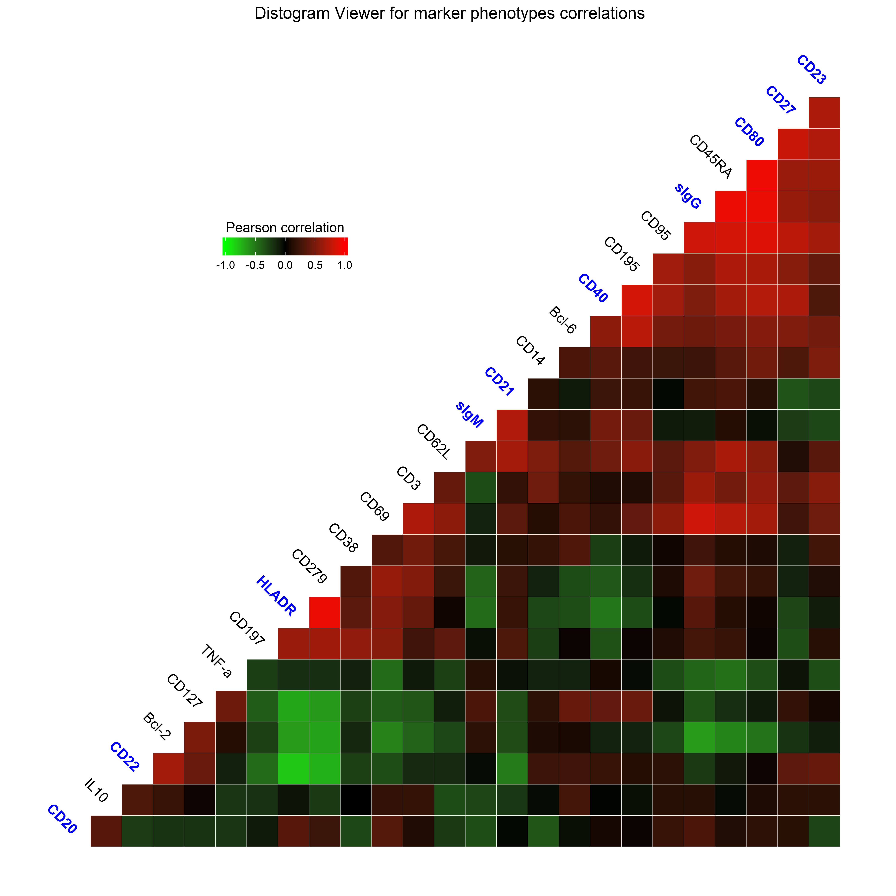

*Distogram representation showing pairwise co-expressions between all cell markers. Each tile corresponds to the co-expression between 2 markers and is gradient-colored based on the Pearson correlation between those 2 markers. Markers used by as clustering markers are shown in blue.*

It is to note that samples having small number of cells (specified by the `th.min_cells` parameter in the import procedure) can be omitted in the computation and the representation. 

<!--
xxx
-->

## <a name="biplot_viewer_function"/> 5.10. Visualization of co-expressions between two markers (Biplot Viewer)
The *Biplot Viewer* aims to visualize co-expressions between 2 markers using a biplot representation. 
In such representation, each cell is represented by a dot which is positioned in a two-dimensional space corresponding to the marker expressions.

This representation can be displayed using the `biplotViewer()` function which takes a `Results` object as parameter.

Cells coming from specific clusters or samples can be selected using the `clusters` and `samples` parameters. 
Moreover, samples can be displayed independently (default behavior) or merged.
In order to seed-up the computations, the number of cells to display can be down-sampled using the `resample.ratio` parameter.  

For instance, such representation can be generated using the following command:

```r
# specifies a set of samples to use
samples  <- c("PBD08_BB078", "PBD08_BB231", "PBD08_BC641", "PBD08_BD619", "PBD08_BD620")
# specifies a set of clusters to use
clusters <- c("20","32","33","51")
# visualizes a biplot based the "CD20" and "HLADR" marker expressions filtered by the selected samples and clusters
biplotViewer(results, x.marker = "CD20", y.marker = "HLADR", samples = samples, clusters = clusters)
```

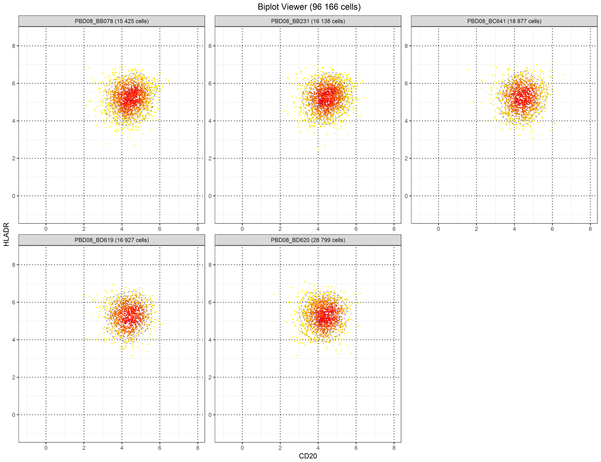

*Biplot representations showing the co-expression between "HLDA-DR" and "CD20" markers for selected samples and clusters. Each cell is represented by a dot which is positioned in a two-dimensional space corresponding to the marker expressions.*

It is to note that this function can only handle `Results` objects imported from SPADE results or FCS files.

<!--
xxx
-->

# <a name="model_functions"/> 6. Modeling methods
## <a name="stat_function_prediction_glm"/> 6.1. Prediction of biological outcomes using generalized linear models
SPADEVizR is able to generate generalized linear models (GLM) to predict biological outcomes associated to each sample based on cluster abundances.
This method aims to identify of linear combinations of clusters abundances that correlates with a biological outcome from on a training dataset.
Based on these linear combinations, this function can predict biological outcomes for a test dataset.

The construction of the generalized linear model can be done using via the `generateGLM()` function.
This function is mainly based on the `glm` and `glm.predic` functions available in R.
Additional visualizations and functionalities specific to cell clustering analysis are provided by the `generateGLM()` function.
This function returns a list of elements including a `glm` object which stores the main results of the generalized linear model.

The `generateGLM()` function takes a `Results` object as parameter and a named numeric vector (`variable`) specifying the values of the biological variable for each sample.
The biological outcomes to predict according to the model must be specified by `NA` values for each desired samples.
The `th.pvalue` parameter allows to remove all the terms having a p-value below this threshold from the model.

For instance, a GLM can be computed using the following command:

```r
# associates to each sample the serology of anti-MVA antibody, except for the "PBD28_BD620" sample which will be predicted
variable <- c("PPD00_BB078" = 50, "PPD00_BB231" = 50, "PPD00_BC641" = 50, "PPD00_BD619" = 50, "PPD00_BD620" = 50, "PBD08_BB078" = NA, "PBD08_BB231" = 16769, "PBD08_BC641" = 16987, "PBD08_BD619" = 11592, "PBD08_BD620" = 7419, "PBD28_BB078" = 14621, "PBD28_BB231" = 7030, "PBD28_BC641" = 1048, "PBD28_BD619" = 3369, "PBD28_BD620" = 3881)

# generates the GLM baed on a set of differentially abundant clusters
resultsGLM <- generateGLM(results, variable = variable, clusters = c("33", "9", "73", "6", "75", "51", "49"))

# displays a summary of the generalized linear model
summary(resultsGLM$model)
## 
## Call:
## stats::glm(formula = y ~ ., data = data)
## 
## Deviance Residuals: 
##     Min       1Q   Median       3Q      Max  
## -4179.4  -2740.7   -994.3   2165.3   7650.0  
## 
## Coefficients:
##             Estimate Std. Error t value Pr(>|t|)
## (Intercept) 5631.014   3752.497   1.501    0.184
## `33`          27.823     17.039   1.633    0.154
## `9`          -10.648     29.207  -0.365    0.728
## `73`          -4.934     35.304  -0.140    0.893
## `6`            6.524     25.556   0.255    0.807
## `75`         -41.553     90.633  -0.458    0.663
## `51`          40.344     85.247   0.473    0.653
## `49`         -12.692     12.170  -1.043    0.337
## 
## (Dispersion parameter for gaussian family taken to be 28046984)
## 
##     Null deviance: 558222854  on 13  degrees of freedom
## Residual deviance: 168281904  on  6  degrees of freedom
##   (1 observation deleted due to missingness)
## AIC: 285.96
## 
## Number of Fisher Scoring iterations: 2
```

The cluster coefficients of the GLM can be displayed using the following command:

```r
# displays the coefficients associated to each cluster
plot(resultsGLM$plot.clusters)
```

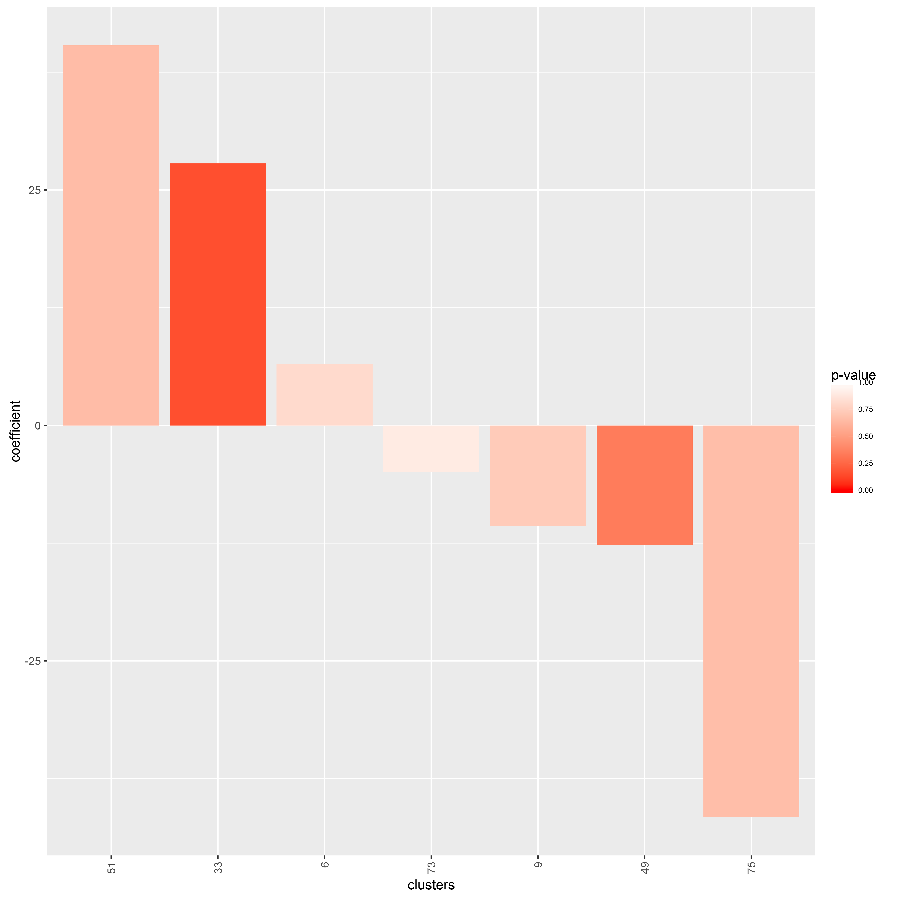
*Box plot representation showing the coefficients associated to each cluster. Biological samples are indicated in the X-axis and the cluster coefficient estimates are indicated in the Y-axis. The size of the boxes is proportional to the coefficient values. Boxes are gradient-colored according to the significance of the p-values.*

The variable predictions of the GLM can be displayed using the following command:

```r
# displays the variable predictions for each sample based on a model constructed with the clusters '33' and '49'
resultsGLM <- generateGLM(results, variable = variable, clusters = c("33", "49"))
plot(resultsGLM$plot.samples)
```

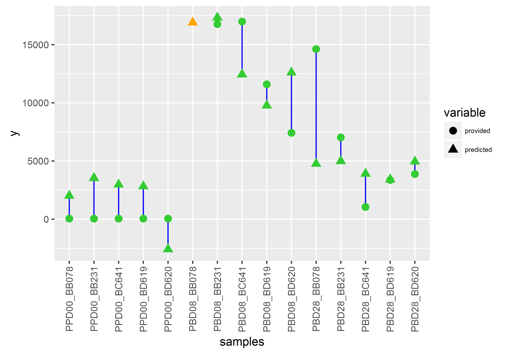
*Dot plot representation showing the known and predicted variable values. Biological samples are indicated in the X-axis and known and predict variable values are indicated in the Y-axis. Dot represent the known variable value for a given sample and triangle represent the predicted variable value for a given sample. Blue lines indicate the differences between known and predicted variable values.*

## <a name="stat_function_prediction_cox"/> 6.2. Prediction of biological outcomes using Cox proportional hazards regression models
SPADEVizR is able to generate Cox proportional hazards regression models (Cox models) to predict biological outcomes associated to each sample based on cluster abundances in the context of survival studies.
This method aims to identify a hazard function (modeled as a sum of exponential coefficients) on a training dataset based on a hypothesis of proportional risks.
Based on these variable coefficients, this function can predict biological outcomes for a test dataset, in the context of survival/progression studies.

The construction of the generalized linear model can be done using via the `generateCPHM()` function.
This function is mainly based on the `coxph` and `coxph.predic` functions available in R but this function additionally offers visualization functionalities (based on the 'ggfortify' package) specific to cell clustering analysis.
This function returns a list of elements including a `coxph` object which stores the main results of the Cox proportional hazards regression model.

The `generateCPHM()` function takes a `Results` object as parameter, a named numeric vector (`variable`) specifying the values of the biological variable for each sample and a named logical vector (`status`) specifying the status for each sample.
The biological outcomes to predict according to the model must be specified by `NA` values for desired samples in the `variable` and `status` vectors.
The `variable` and `status` vectors must be synchronized.
The `th.pvalue` parameter allows to remove all the terms having a p-value below this threshold from the model.

For instance, a Cox model can be computed using the following command:

```r
# associates to each sample the serology of anti-MVA antibody and an illustrative status (high anti-MVA antibody levels), except for the "PPD00_BB078" sample which will be predicted
variable <- c("PPD00_BB078" = NA, "PPD00_BB231" = 50, "PPD00_BC641" = 50, "PPD00_BD619" = 50, "PPD00_BD620" = 50, "PBD08_BB078" = 32541, "PBD08_BB231" = 16769, "PBD08_BC641" = 16987, "PBD08_BD619" = 11592, "PBD08_BD620" = 7419, "PBD28_BB078" = 14621, "PBD28_BB231" = 7030, "PBD28_BC641" = 1048, "PBD28_BD619" = 3369, "PBD28_BD620" = 3881)
status   <- c("PPD00_BB078" = NA, "PPD00_BB231" = FALSE, "PPD00_BC641" = FALSE, "PPD00_BD619" = FALSE, "PPD00_BD620" = FALSE, "PBD08_BB078" = TRUE, "PBD08_BB231" = TRUE, "PBD08_BC641" = TRUE, "PBD08_BD619" = TRUE, "PBD08_BD620" = TRUE,"PBD28_BB078" = TRUE, "PBD28_BB231" = TRUE, "PBD28_BC641" = TRUE, "PBD28_BD619" = TRUE, "PBD28_BD620" = TRUE)

# generates the Cox model based on a set of differentially abundant clusters
resultsCPHM <- generateCPHM(results, variable = variable, status = status, clusters = c("33", "9", "73", "78", "52", "49"))

# displays a summary of the Cox model
summary(resultsCPHM$model)
## Call:
## survival::coxph(formula = survival::Surv(variable, status) ~ 
##     ., data = data.training)
## 
##   n= 14, number of events= 10 
## 
##           coef exp(coef)  se(coef)      z Pr(>|z|)
## `33` -0.018323  0.981844  0.011964 -1.532    0.126
## `9`  -0.004198  0.995811  0.023353 -0.180    0.857
## `73`  0.024866  1.025178  0.041632  0.597    0.550
## `78`  0.011468  1.011534  0.035401  0.324    0.746
## `52` -0.007970  0.992062  0.013818 -0.577    0.564
## `49`  0.008519  1.008556  0.030385  0.280    0.779
## 
##      exp(coef) exp(-coef) lower .95 upper .95
## `33`    0.9818     1.0185    0.9591     1.005
## `9`     0.9958     1.0042    0.9513     1.042
## `73`    1.0252     0.9754    0.9448     1.112
## `78`    1.0115     0.9886    0.9437     1.084
## `52`    0.9921     1.0080    0.9656     1.019
## `49`    1.0086     0.9915    0.9502     1.070
## 
## Concordance= 0.867  (se = 0.124 )
## Rsquare= 0.566   (max possible= 0.884 )
## Likelihood ratio test= 11.67  on 6 df,   p=0.06974
## Wald test            = 5.61  on 6 df,   p=0.4681
## Score (logrank) test = 10.7  on 6 df,   p=0.09818
```

The provided survival curve can be displayed using the following command:

```r
# displays the provided survival curve
plot(resultsCPHM$plot.provided_survival_curve)
```

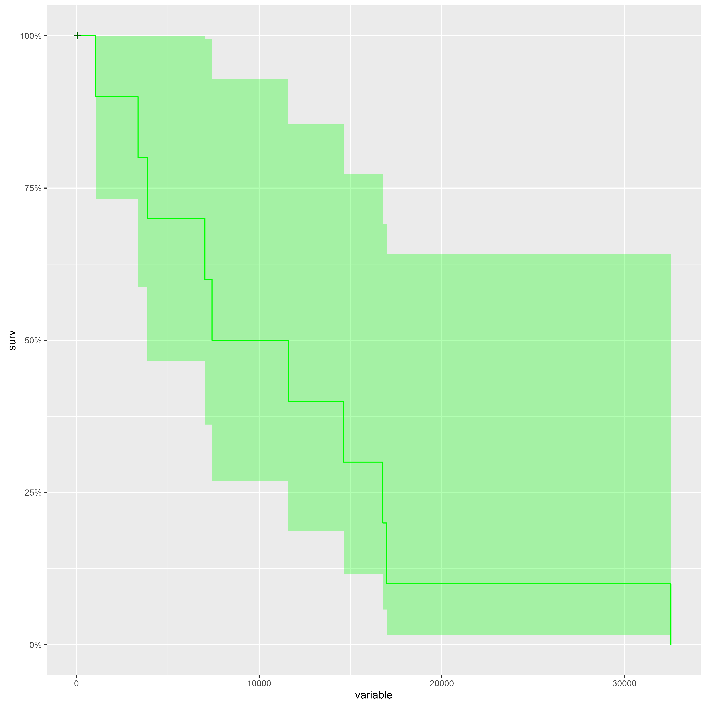
*Kaplan-Meier representation showing the provided survival function. Censored subjects (illustrated here by sample with low anti-MVA antibody expression levels) are indicated on the Kaplan-Meier curve as tick marks.*

The abundance coefficients of the Cox model can be displayed using the following command:

```r
# displays the abundance coefficients associated to each cluster
plot(resultsCPHM$plot.clusters)
```

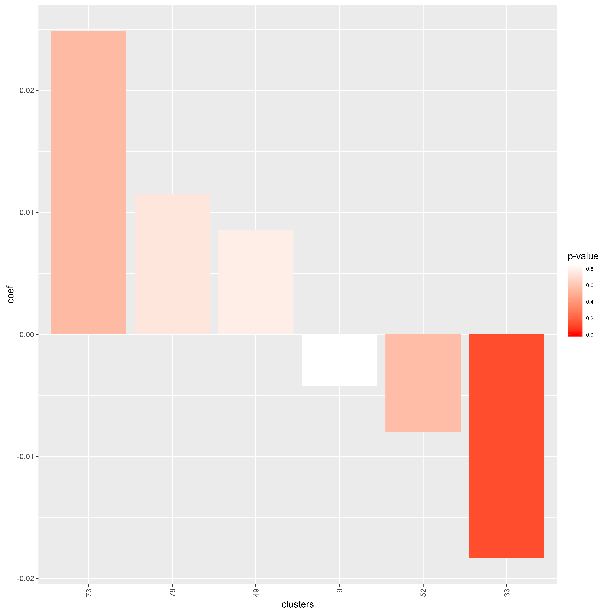
*Box plot representation showing the abundance coefficient associated to each cluster. The size of the boxes is proportional to the coefficient values. Boxes are gradient-colored according to the significance of the p-values.*

The variable predictions of the Cox model can be displayed using the following command:

```r
# displays the variable predictions for each sample based on a model constructed with the clusters '73', '52' and '33'
resultsCPHM <- generateCPHM(results, variable = variable, status = status, clusters = c("73", "52", "33"))
plot(resultsCPHM$plot.samples)
```

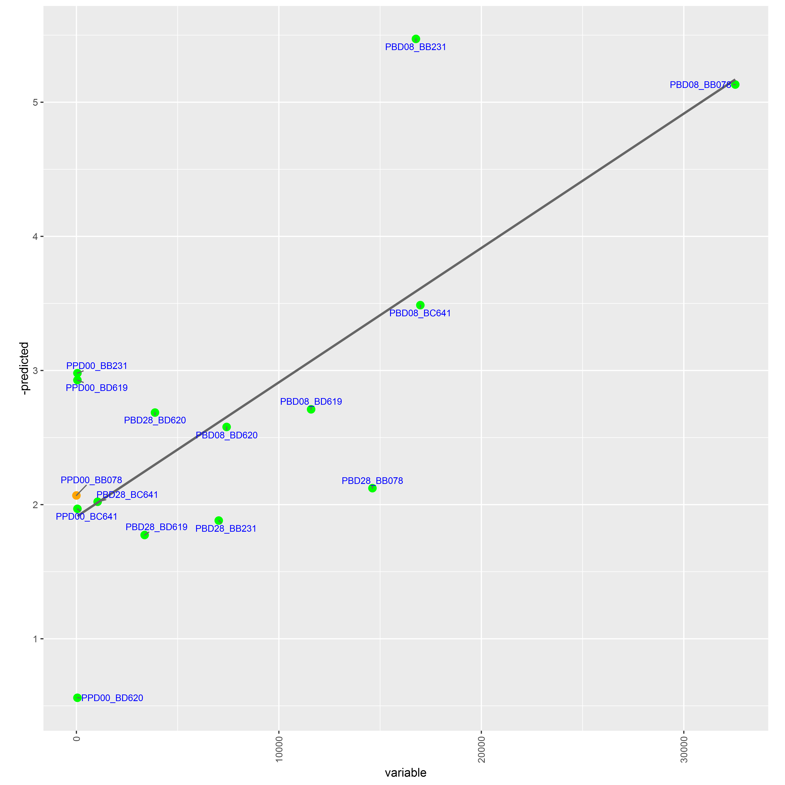
*Biplot representation showing the provided and predicted variables values for each sample. Provided values are displayed in the X-axis and predicted values are displayed in the Y-axis. Samples with no provided variable values are represented along the Y-axis.*


## <a name="stat_function_prediction_rf"/> 6.3. Prediction of biological outcomes using random forest models
SPADEVizR is able to generate random forest models to predict biological outcomes associated to each sample based on cluster abundances, in the context of survival/progression studies.
Random forest is a machine learning technique based on decision trees that allows to prediction biological features on a training dataset. 
Based on the set of generated trees, this function can predict biological outcomes for a test dataset.

The construction of a random forest model can be done using via the `generateRFM()` function.
This function is mainly based `randomForestSRC` pacakge for statistical aspects and on the `ggRandomForests` package for visualization aspects.
This function returns a list of elements including a `rfsrc` object which stores the main results of the random forest model.

The `generateRFM()` function takes a `Results` object as parameter, a named numeric vector (`variable`) specifying the values of the biological variable for each sample, and a named logical vector (`status`) specifying the status for each sample.
The biological outcomes to predict according to the model must be specified by `NA` values for desired samples in the `variable` and `status` vectors.
The `variable` and `status` vectors must be synchronized.

For instance, a random forest model can be computed using the following command:

```r
# associates to each sample the serology of anti-MVA antibody, except for the "PPD00_BD620" sample which will be predicted
variable <- c("PPD00_BB078" = 50, "PPD00_BB231" = 50, "PPD00_BC641" = 50, "PPD00_BD619" = 50, "PPD00_BD620" = NA, "PBD08_BB078" = 32541, "PBD08_BB231" = 16769, "PBD08_BC641" = 16987, "PBD08_BD619" = 11592, "PBD08_BD620" = 7419, "PBD28_BB078" = 14621, "PBD28_BB231" = 7030, "PBD28_BC641" = 1048, "PBD28_BD619" = 3369, "PBD28_BD620" = 3881)
status   <- c("PPD00_BB078" = FALSE, "PPD00_BB231" = FALSE, "PPD00_BC641" = FALSE, "PPD00_BD619" = FALSE, "PPD00_BD620" = NA, "PBD08_BB078" = TRUE, "PBD08_BB231" = TRUE, "PBD08_BC641" = TRUE, "PBD08_BD619" = TRUE, "PBD08_BD620" = TRUE,"PBD28_BB078" = TRUE, "PBD28_BB231" = TRUE, "PBD28_BC641" = TRUE, "PBD28_BD619" = TRUE, "PBD28_BD620" = TRUE)

# generates the random forest model based on a set of differentially abundant clusters
resultsRFM <- generateRFM(results, variable = variable, status=status, clusters = c("33", "9", "73", "78", "52", "49"))
```

<!--
# displays a summary of the random forest model
print(resultsRFM$model)
-->

<!--
In random forests, the test set error is estimated internally during the run.
This information can be displayed using the following command:

```r
# displays the OOB Error Rate of the computed trees
#plot(resultsRFM$plot.error)
```
*Representation showing the Out-Of-Bag error rate along the number of computed tree. The line shows a stabilization of the error rate after 500 trees under a probability of prediction success of 0.5*
-->

The most important variables can be displayed using the following command:

```r
# displays variable importance
plot(resultsRFM$plot.vimp)
```

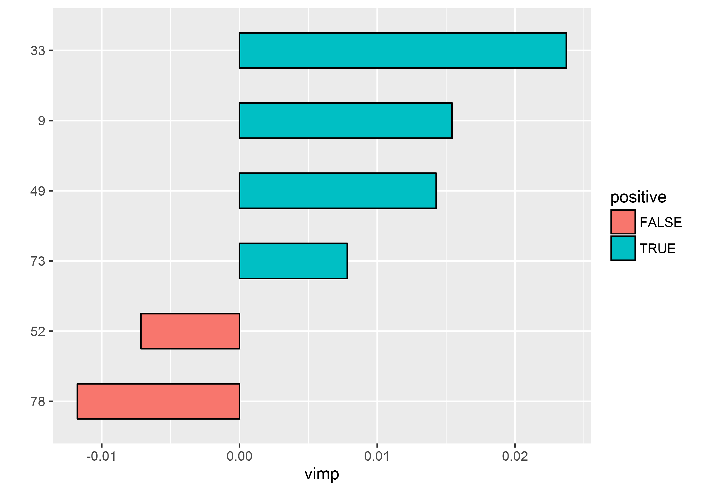
*Representation showing the most important variables (VIMP) selected in the decision tree of the random forest.*

The minimum depth is the number of nodes along the shortest path from the root node down to the nearest leaf node.
The minimum depth of each variable can be displayed using the following command:

```r
# displays the minimum depth of each variable
plot(resultsRFM$plot.minimal_depth)
```

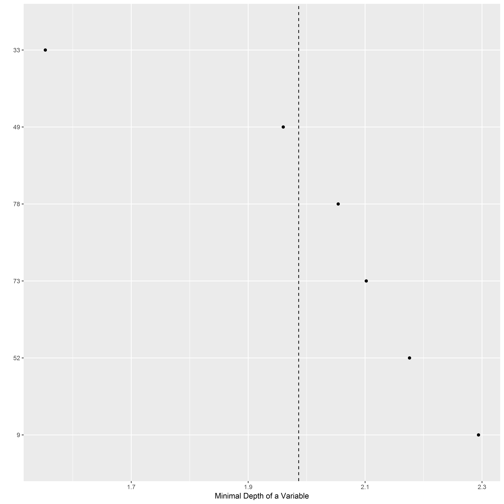
*Representation showing the minimal depth of each important variable. The variables that split closer to the root node have a greater influence on prediction accuracy. The vertical dashed line corresponds to the mean minimal depth of variables.*

The variable predictions of the random forest model can be displayed using the following command:

```r
# displays the variable predictions for each sample based on a model constructed with the clusters '33' and '49'
resultsRFM <- generateRFM(results, variable = variable, status = status, clusters = c("33","49"))
plot(resultsRFM$plot.samples)
```

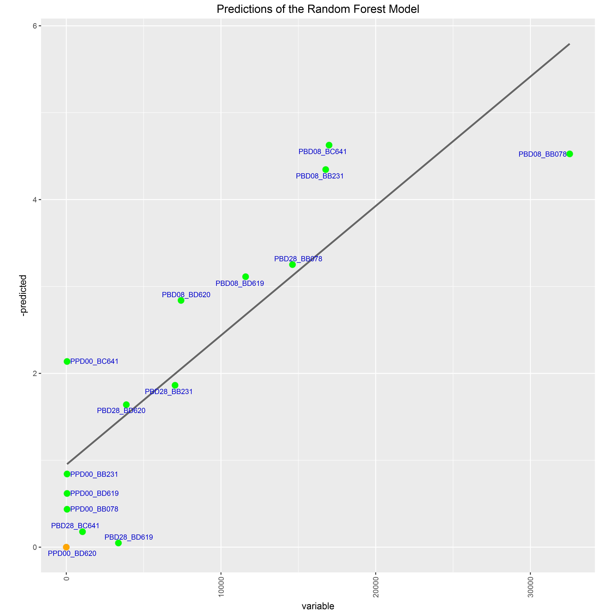
*Biplot representation showing the provided and predicted variables values for each sample. Provided values are displayed in the X-axis and predicted values are displayed in the Y-axis. Samples with no provided variable values are represented along the Y-axis.*

# <a name="qc"/> 7. Quality Control methods
## <a name="qc_small"/> 7.1. Quantification of clusters having a small number of associated cells
The quantification of the number of clusters having small number of associated cells in the whole dataset is important to correctly interpret the clustering results.
A low percentage indicates a good cell clustering result.
If the number of cell clusters is too high, then some clusters can be very small.
Thereby, the phenotypical characterization of such clusters can be meaningless.

The `smallClustersQC()` function allows identifying clusters having a number of cells smaller than a specific threshold (set to 50 by default).
The function can generate a PDF file containing a heatmap representation which highlights these small clusters.
Sample contributions are shown on the left part of the heatmap while the overall dataset contribution is shown on the right part of the heatmap.

For instance, clusters having less than 50 cells in the whole dataset can be identified using the following command:

```r
# generates a PDF file reporting the cluster representativeness in the dataset 
small <- qcSmallClusters(results, PDFfile = "SPADEVizR-qcreport-SmallClusters_heatmap.pdf", th = 50)
```

This function returns a list of two elements. 
The `perc` numeric element specifies the percentage of small clusters among all clusters of the dataset. 
The `cluster.small` dataframe element specifies the small clusters in the dataset. 

An illustrative QC heatmap for small clusters is available on the SPADEVizR github [(/README/SPADEVizR-qcreport-SmallClusters_heatmap.pdf file)](https://github.com/tchitchek-lab/SPADEVizR/blob/master/README/SPADEVizR-qcreport-SmallClusters_heatmap.pdf).

The following figure shows a QC heatmap for small clusters.
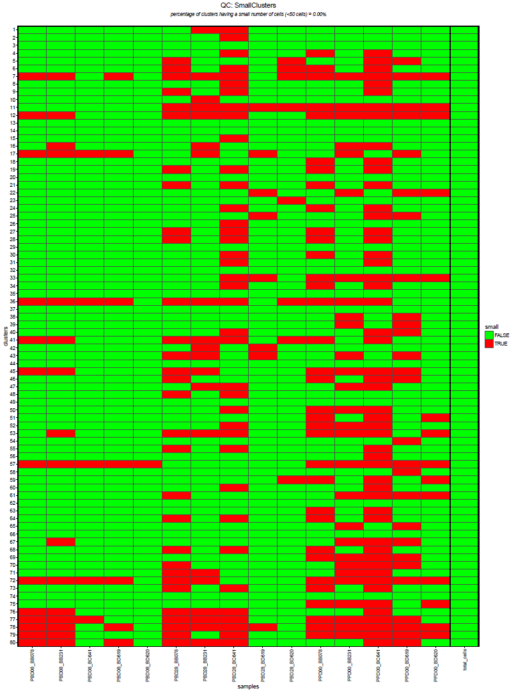 

Heatmap summarizing the cell clusters having a number of associated cells lower than 100 cells (specified by the user) in the whole dataset.
Sample contributions are shown on the left part of the heatmap while the overall dataset contribution is shown on the right part of the heatmap.
The percentage of clusters having a small number of cells among all clusters is indicated on the top of the heatmap.

## <a name="qc_uniform_phenotypes"/> 7.2. Quantification of clusters having uniform phenotypes

Furthermore, the quantification of the number of clusters having uniform phenotypes is important to correctly interpret the clustering results.
A high percentage indicates a good cell clustering result.
If the expression distributions for some markers of a given cluster are non-unimodal (representing some sub-populations) or with high ranges, then the characterization of this cluster can be biased. 

The `qcUniformClusters()` function allows reporting these two kinds of information. 
Firstly, the identification of clusters having non-unimodal marker expression densities is performed using a Hartigan's dip test (with a p-value lower than the `th.pvalue` parameter). 
Secondly, the identification of clusters having high-range of expressions is performed based on an interquartile range (IQR) threshold (specified by the `th.IQR` parameter).
Uniform clusters are defined as clusters having unimodal and low range expression density.

The function can generate two PDF files. 
The first PDF contains a heatmap summarizing for each cluster which markers are considered as uniform.
Clustering markers are displayed on the left part of the heatmap.
For informative purposes, non-clustering marker are displayed on the right part of the heatmap.

The second PDF contains the expression densities of each marker for each cluster.
For each marker distribution, the Hartigan's Dip test p-value, which indicates if the distribution in non-unimodal, and the interquartile range (IQR), indicating if the expression range is too high, are indicated.
Uniform markers, represented in green, are defined as markers having a p-value lower than 0.05 (specified by the user) and an IQR lower than 2 (specified by the user).
Marker expressions with non-unimodal distribution or with a high spread, are represented in red. 

For instance, clusters having unimodal clustering marker expressions can be identify using the following commands:

```r
# generates two PDF files reporting the cluster phenotype accuracies in the dataset 
uniform <- qcUniformClusters(results,
								  density.PDFfile = "SPADEVizR-qcreport-UniformClusters_density.pdf",
								  heatmap.PDFfile = "SPADEVizR-qcreport-UniformClusters_heatmap.pdf",
								  uniform.test   = "unimodality")
```


This function returns a list of two elements. 
The `perc` numeric element specifies the percentage of clusters having only uniform phenotype among all clusters of the dataset (This percentage is only based on the clustering markers). 
The `accuracy.matrix` dataframe element specifies the clusters having uniform phenotypes in the dataset. 

The following figure shows a generate QC heatmap report.
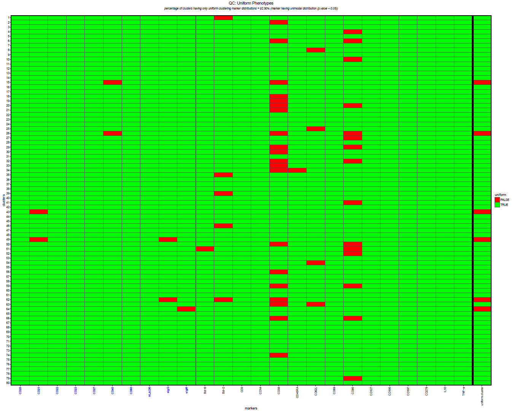

Heatmap summarizing the cell clusters having uniform phenotypes. 
Uniform clusters are defined as clusters having unimodal and low range expression density for all the clustering markers and displayed in the last column of the heatmap.
The unimodality and spread of marker expressions of each cluster are determined using the Hartigan's Dip test and the interquartile range (IQR). 
Both Dip test p-value and IQR thresholds are specified by the user.
Clustering markers are displayed on the left part of the heatmap.
For informative purposes, non-clustering marker are displayed on the right part of the heatmap.
The percentage of clusters having an uniform phenotype among all clusters is indicated on the top of the heatmap.
A high percentage indicates a good cell clustering result.

An illustrative QC heatmap report for uniform clusters is available on the SPADEVizR github [(/README/SPADEVizR-qcreport-UniformClusters_heatmap.pdf file)](https://github.com/tchitchek-lab/SPADEVizR/blob/master/README/SPADEVizR-qcreport-UniformClusters_heatmap.pdf).

The following figure shows the marker expression densities for one given cluster.
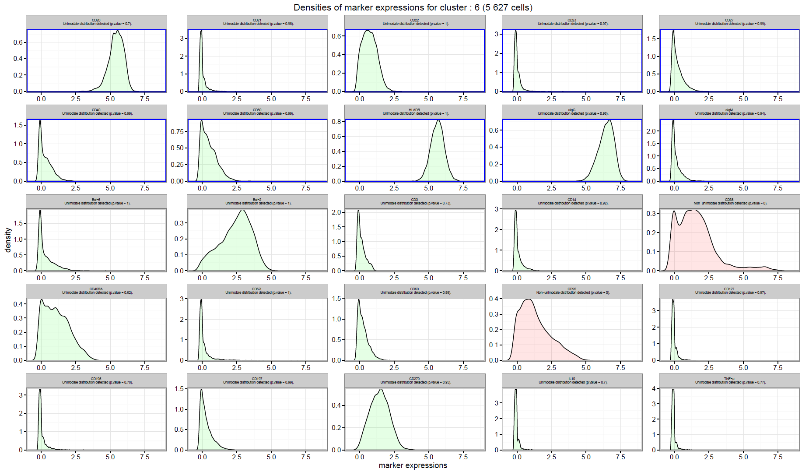

Expression distributions for each marker of the cluster 6. 
Blue rectangles indicate clustering markers.
For each marker distribution, the Hartigan's Dip test p-value, which indicates if the distribution in non-unimodal, and the interquartile range (IQR), indicating if the expression range is too high, are indicated.
Non-uniform markers, represented in red, are defined as markers having a p-value lower than 0.05 (specified by the user) and an IQR higher than 2 (specified by the user).
Marker expressions with unimodal distribution or with a low spread of expression, are represented in green.

An illustrative QC density report for uniform clusters is available on the SPADEVizR github [(/README/SPADEVizR-qcreport-UniformClusters_density.pdf file)](https://github.com/tchitchek-lab/SPADEVizR/blob/master/README/SPADEVizR-qcreport-UniformClusters_density.pdf).

It is to note that the generation of the files can be controlled by setting NULL to the `density.PDFfile` or the `heatmap.PDFfile` parameter (in particular, the generation of the QC density file can take few minutes).

# <a name="export"/> 8. Exportation methods
All SPADEVizR objects can be exported to tab separated text files using the `export()` function.
These resulting text files will contain explicit information about the objects (for example statistical details, tables, marker names, sample names, etc...). Then, those tab separated files can be opened with Microsoft Excel(c), Libre Office Calc or Tableau Software.

For instance, such export can be done using the following command:

```r
# exports of an AC object previously created 
export(AC, filename = "export.txt")
```

# <a name="report"/> 9. Reporting methods

SPADEVizR is able to generate a PDF document gathering all visual representation of the SPADEVizR package. 
This report is especially useful when interpreting a whole cell clustering analyses.

This document can be generated using the `createReport()` function which takes a `Results` object. 
This function required a vector specifying the desired representation (provided to the `select.plots` parameter) and the location of the output PDF file (`PDFfile` parameter).
The `select.plots` vector can contain either the nicknames of the viewer or `AC`, `DAC`, `CC` or `AP` objects. 

Allowed nicknames in this vector are among: 

 * "[count](#count_viewer_function)" (included by default): Displays a Count Viewer representation;
 * "[tree](#tree_viewer_function)": Displays a SPADE Tree Viewer representation;
 * "[heatmap](#heatmap_viewer_function)" (included by default): Displays an Heatmap Viewer representation;
 * "[boxplot](#boxplot_viewer_function)": Displays a Boxplot Viewer representation for each cluster;
 * "[kinetics](#kinetics_viewer_function)": Displays a Kinetic Viewer representation for each cluster;
 * "[streamgraph](#streamgraph_viewer_function)": Displays a Streamgraph Viewer representation;
 * "[pheno](#pheno_viewer_function)": Displays a Pheno Viewer representation;
 * "[MDSclusters](#MDS_viewer_function)" (included by default): Displays a MDS Viewer representation at the cluster level;
 * "[MDSsamples](#MDS_viewer_function)": Displays a MDS Viewer representation at the sample level;
 * "[distogram](#distogram_viewer_function)": Displays a Distogram Viewer representation;
 * "kinetics_cluster": Displays two "[kinetics](#kinetics_viewer_function)" and "[cluster](#cluster_viewer_function)" representations juxtaposed (one on the side of the other) for each cluster;
 * "boxplot_cluster": Displays two "[boxplot](#boxplot_viewer_function)" and "[cluster](#cluster_viewer_function)" representations juxtaposed (one on the side of the other) for each cluster;

*The order of the representations in the document will follow the same order as in this vector*

For instance, such kind of report can be generated using the following commands:

```r
# generates a SPADEVizR report with various viewers and statistical objects
createReport(results, PDFfile = "SPADEVizR-report.pdf", select.plots = c("tree","count", "heatmap", "kinetics_pheno", resultsAC, resultsDAC, resultsCC, results_AP, "distogram"), verbose = FALSE)
```


An illustrative report is available on the SPADEVizR github [(/README/SPADEVizR-report.pdf file)](https://github.com/tchitchek-lab/SPADEVizR/blob/master/README/SPADEVizR-report.pdf).


# <a name="misc"/> 10. Miscellaneous functions

## <a name="misc_merge"/> 10.1. Merging of cell clusters
In some analysis situations, it could be usefull to merge the abundances and the phenotypes of two or more cell clusters (belonging for example to the same cell populations).

For instance, a merging of some cell clusters can be done using the following command: 

```r
# merges the abundances and the phenotypes of clusters 1 and 2 into a new cluster in a Results object
newresults <- mergeClusters(results, clusters=c("1","2"),name="combined")

print(newresults@cluster.names)
##  [1] "1"        "2"        "3"        "4"        "5"        "6"       
##  [7] "7"        "8"        "9"        "10"       "11"       "12"      
## [13] "13"       "14"       "15"       "16"       "17"       "18"      
## [19] "19"       "20"       "21"       "22"       "23"       "24"      
## [25] "25"       "26"       "27"       "28"       "29"       "30"      
## [31] "31"       "32"       "33"       "34"       "35"       "36"      
## [37] "37"       "38"       "39"       "40"       "41"       "42"      
## [43] "43"       "44"       "45"       "46"       "47"       "48"      
## [49] "49"       "50"       "51"       "52"       "53"       "54"      
## [55] "55"       "56"       "57"       "58"       "59"       "60"      
## [61] "61"       "62"       "63"       "64"       "65"       "66"      
## [67] "67"       "68"       "69"       "70"       "71"       "72"      
## [73] "73"       "74"       "75"       "76"       "77"       "78"      
## [79] "79"       "80"       "combined"
```

## <a name="misc_delete"/> 10.2. Deletion of cell clusters
In some analysis situations, it could be usefull to delete one or more cell clusters (having for example marginal phenotypes or very small number of associated cells).

For instance, a deletion of some cell clusters can be done using the following command: 

```r
# deletes the clusters 1 and 2 from a Results object
newresults <- removeClusters(results, clusters=c("1","2"))

print(newresults@cluster.names)
##  [1] "3"  "4"  "5"  "6"  "7"  "8"  "9"  "10" "11" "12" "13" "14" "15" "16"
## [15] "17" "18" "19" "20" "21" "22" "23" "24" "25" "26" "27" "28" "29" "30"
## [29] "31" "32" "33" "34" "35" "36" "37" "38" "39" "40" "41" "42" "43" "44"
## [43] "45" "46" "47" "48" "49" "50" "51" "52" "53" "54" "55" "56" "57" "58"
## [57] "59" "60" "61" "62" "63" "64" "65" "66" "67" "68" "69" "70" "71" "72"
## [71] "73" "74" "75" "76" "77" "78" "79" "80"
```


## <a name="misc_annot"/> 10.3. Automatic annotation of cell clusters
SPADEVizR is able to automaticaly annotate cell clusters based on their phenotypes.
Such annotation is performed based on the marker catergorial expressions and a dataframe specifying for each cell populations the acceptable marker categories.
Marker expression categories are computed as presented in the heatmap viewer.
Such dataframe must provide for each marker of each cell population a character value specifying the set of categrotial in a vector form (i.e. 'c(1,2)' for categories 1 and 2).
NA values can be used to indicate that a marker is not needed for the annotation to a cell population.

For instance, an automatic annotation of the cell clusters can be done using the following commands: 

```r
# defines an annotation dataframe
annotations <- matrix(rep(NA,8),nrow=4,ncol=2)
annotations <- data.frame(annotations)
rownames(annotations) <- c("resting_memory","activated_memory","naive_B","tissuelike_memory")
colnames(annotations) <- c("CD21","CD27")
annotations["resting_memory","CD21"] <- "c(2,3,4,5)"
annotations["resting_memory","CD27"] <- "c(2,3,4,5)"
annotations["activated_memory","CD21"] <- "1"
annotations["activated_memory","CD27"] <- "c(2,3,4,5)"
annotations["naive_B","CD21"] <- "c(2,3,4,5)"
annotations["naive_B","CD27"] <- "1"
annotations["tissuelike_memory","CD21"] <- "1"
annotations["tissuelike_memory","CD27"] <- "1"
print(annotations)
##                         CD21       CD27
## resting_memory    c(2,3,4,5) c(2,3,4,5)
## activated_memory           1 c(2,3,4,5)
## naive_B           c(2,3,4,5)          1
## tissuelike_memory          1          1

# annotates the cell clusters in a Results object#
# cell clusters are renamed according to the population names
results <- annotateClusters(results, annotations=annotations)
```

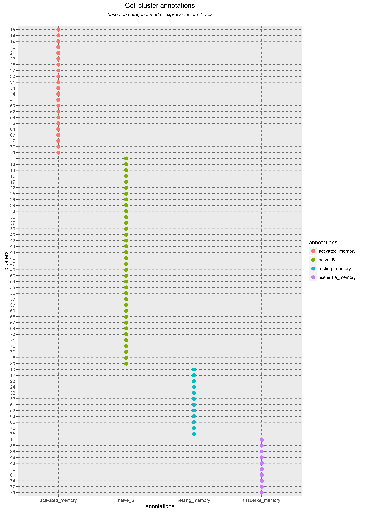

```r
results@cluster.names
##  [1] "1:naive_B"            "2:activated_memory"   "3:naive_B"           
##  [4] "4:activated_memory"   "5:tissuelike_memory"  "6:activated_memory"  
##  [7] "7:activated_memory"   "8:naive_B"            "9:activated_memory"  
## [10] "10:resting_memory"    "11:tissuelike_memory" "12:resting_memory"   
## [13] "13:naive_B"           "14:naive_B"           "15:activated_memory" 
## [16] "16:naive_B"           "17:naive_B"           "18:activated_memory" 
## [19] "19:activated_memory"  "20:resting_memory"    "21:activated_memory" 
## [22] "22:naive_B"           "23:activated_memory"  "24:resting_memory"   
## [25] "25:naive_B"           "26:activated_memory"  "27:activated_memory" 
## [28] "28:naive_B"           "29:naive_B"           "30:activated_memory" 
## [31] "31:activated_memory"  "32:resting_memory"    "33:resting_memory"   
## [34] "34:activated_memory"  "35:tissuelike_memory" "36:naive_B"          
## [37] "37:naive_B"           "38:tissuelike_memory" "39:naive_B"          
## [40] "40:naive_B"           "41:activated_memory"  "42:naive_B"          
## [43] "43:naive_B"           "44:naive_B"           "45:naive_B"          
## [46] "46:tissuelike_memory" "47:naive_B"           "48:tissuelike_memory"
## [49] "49:naive_B"           "50:activated_memory"  "51:resting_memory"   
## [52] "52:activated_memory"  "53:naive_B"           "54:naive_B"          
## [55] "55:naive_B"           "56:naive_B"           "57:naive_B"          
## [58] "58:naive_B"           "59:activated_memory"  "60:naive_B"          
## [61] "61:tissuelike_memory" "62:resting_memory"    "63:resting_memory"   
## [64] "64:activated_memory"  "65:naive_B"           "66:resting_memory"   
## [67] "67:naive_B"           "68:activated_memory"  "69:naive_B"          
## [70] "70:naive_B"           "71:naive_B"           "72:naive_B"          
## [73] "73:activated_memory"  "74:tissuelike_memory" "75:resting_memory"   
## [76] "76:naive_B"           "77:tissuelike_memory" "78:resting_memory"   
## [79] "79:tissuelike_memory" "80:naive_B"
```

# <a name="object_structures"/> 11. SPADEVizR object structures

## <a name="object_structure_uml"/> 11.1. Overview of SPADEVizR objects
In SPADEVizR, five objects are used to store computational results: `Results` (containing imported the cell clustering results), `AC` (corresponding to Abundant Cluster), `DAC` (corresponding to Differentially Abundant Clusters), `CC` (corresponding to Correlated Clusters) and `AP` (corresponding to Abundance Profiles) objects.

The following UML diagram summarizes the structure of those objects:


*The `Results` objects is used to store clustering results from SPADE and from other automatic gating algorithm. `AC` (Abundant Cluster), `DAC` (Differentially Abundant Clusters), and `CC` (Correlated Clusters) objects are used to store statistical properties of clusters having specific behaviors. Finally, the `AP` (Abundance Profiles) object is used to store statistical properties of cluster classification. All SPADEVizR objects can be printed, plotted and exported.*

## <a name="object_structure_results"/> 11.2. Structure of a Results object 
The `Results` object is a S4 object containing mainly the cluster abundances and phenotypes. 

Different slots are available for a given `Results` object:

slot               | description 
-------------------|-----------------------------------------------------------|------
cluster.abundances | a numeric dataframe containing the number of cells of each cluster for each sample
cluster.phenotypes | a numerical dataframe containing marker median expressions of each cluster for each sample
cluster.names      | a character vector containing the cluster names
sample.names       | a character vector containing the sample names
marker.names       | a character vector containing the marker names
clustering.markers | a character vector specifying markers that have been used during the clustering procedure
cluster.number     | a numeric specifying the number of cell clusters
bounds             | a numeric dataframe containing the bound values for each marker. These bound values correspond to quantiles when `Results` have been imported from SPADE or FCS files. These bounds values correspond to maximal and minimal bounds when `Results` have been imported from tables.
use.raw.medians    | a logical specifying if the marker expressions correspond to the raw or transformed data
flowset            | a flowSet object (flowCore package) containing the imported FCS files (can be NULL)
fcs.files          | a character vector containing the absolute path of the FCS files (can be NULL)
graph              | an igraph object containing the SPADE tree structure (can be NULL)
graph.layout       | a numeric matrix containing the SPADE tree layout (can be NULL)

## <a name="object_structure_AC"/> 11.3. Structure of an AC object
The `AC` object is a S4 object containing the main information related to the Abundant Clusters identified by the [`identifyAC()`](#stat_function_identifyAC) function.  

Different slots are available for a given `AC` object:

slot       | description
-----------|---------------------------------------------------
sample.names       | a character vector containing the samples used
cluster.size       | a numeric vector containing the total number of associated cells for each cluster of the considered samples
use.percentages    | a logical specifying if the computation was performed on the percentage of cell abundance
method             | a character containing the name of the statistical test used ("t.test" or "wilcox.test")
method.adjust      | a character containing the name of the multiple correction method used ("none", holm", "hochberg", "hommel", "bonferroni", "BH", "BY" or "fdr")
mu                 | a numeric specifying the theoretical value (mu) of the one sample statistical test
th.pvalue          | a numeric value specifying the p-value threshold
results            | a dataframe containing for each cluster (first column): the abundance mean (second column), the abundance standard deviation (third column) of the biological condition, the associated p-value (fourth column) and a logical (fifth column) specifying if the cluster is significantly abundant

## <a name="object_structure_DAC"/> 11.4. Structure of a DAC object
The `DAC` object is a S4 object containing the main information related to the Differentially Abundant Clusters identified by the [`identifyDAC()`](#stat_function_identifyDAC)  

Different slots are available for a given `DAC` object:

slot       | description
-----------|---------------------------------------------------
sample.cond1       | a character vector specifying the names of the samples of the first biological condition
sample.cond2       | a character vector specifying the names of the samples of the second biological condition
cluster.size       | a numeric vector containing the total number of associated cells for each cluster of the two merged conditions 
use.percentages    | a logical specifying if the computation was performed on the percentage of cell abundance
method             | a character containing the name of the statistical test used ("t.test" or "wilcox.test")
method.adjust      | a character containing the name of the multiple correction method used ("none", holm", "hochberg", "hommel", "bonferroni", "BH", "BY" or "fdr")
method.paired      | a logical indicating if the statistical test has been performed in a paired manner
th.fc              | a numeric value specifying the fold-change threshold
th.pvalue          | a numeric value specifying the p-value threshold
results            | a dataframe containing for each cluster (first column): the abundance mean (second column) and the abundance standard deviation (third column) for the first biological condition, the abundance mean (fourth column) and the abundance standard deviation (fifth column) for the second biological condition, the abundance fold-change (sixth column), the associated p-value (seventh column) and a logical (eighth column) specifying if the cluster is significantly differentially abundant

## <a name="object_structure_CC"/> 11.5. Structure of a CC object
The `CC` object is a S4 object containing object containing the main information related to the Correlated Clusters identify by the [`identifyCC()`](#stat_function_identifyCC) function.

Different slots are available for a given `CC` object:

slot       | description
-----------|---------------------------------------------------
sample.names       | a character vector containing the samples used to compute Correlated Clusters
variable           | a numeric vector containing the expression values of the associated variable
cluster.size       | a numeric vector containing the total number of associated cells for each cluster of the considered samples
use.percentages    | a logical specifying if the computation was performed on the percentage of cell abundance
method             | a character containing the name of the statistical test used ("pearson", "spearman" or "kendall")
method.adjust      | a character containing the name of the multiple correction method used ("none", holm", "hochberg", "hommel", "bonferroni", "BH", "BY" or "fdr")
th.correlation     | a numeric value specifying the correlation threshold (R)
th.pvalue          | a numeric value specifying the p-value threshold
results            | a dataframe containing for each cluster (first column): the coefficient of correlation R (second column), the associated p-value (third column) and a logical (fourth column) specifying if the cluster is significantly correlated

## <a name="object_structure_AP"/> 11.6. Structure of an AP object
The `AP` object is a S4 object containing the information related to the Abundance Profiles returned by the [`classifyAbundanceProfiles()`](#stat_function_classify_abundance_profiles) function.

Different slots are available for a given `AP` object:

slot               | description
-----------|---------------------------------------------------
class.number       | a numeric value specifying the number of classes
cluster.size       | a numeric vector containing the number of cells for each cluster
method             | a character specifying the method used to classify cluster ("hierarchical_h", "hierarchical_k", "k-means", "eigencell" or "clique")
method.parameter   | a numeric parameter used by the classification method
classes            | a two column dataframe containing cluster the associations between clusters (first column) and classes (second column)

# <a name="notes"/> 12. Notes and discussion
SPADEVizR significantly enhances the functionalities of the SPADE algorithm by providing statistical methods allowing the identification of relevant cell clusters and by allowing the classification of the cell clusters based on the abundance profiles.
The visual representations available in SPADEVizR allows efficient characterizations of the cell cluster phenotypes.
SPADEVizR can generate generalized linear models, Cox proportional hazards regression models and random forest models to predict biological outcomes, based on the cluster abundances.
Importantly, SPADEVizR can import cell clustering results from various automatic gating software.

The modeling functionalities available in SPADEVizR can be discussed in the context of the FlowCap-IV contest [11,12].
The aim of this challenge was mainly to identify cell populations, in flow cytometry data, correlating with a clinical outcome, and that can be used to predict the outcome in other subjects.
In this contest, the progression to AIDS in HIV+ subjects was used as the clinical outcome.
This observed clinical status consisted on progression to AIDS (or death) or no progression (or no death).
This dataset consists of 766 cytometry samples obtained from 383 patients, each measuring the expression of 14 cell markers.
More details about FlowCap challenges can be found at http://flowcap.flowsite.org/ and FCS files can be download in the flow repository database (https://flowrepository.org/) under accession number "FR-FCM-ZZ99". 

Several automatic gating software have been benchmarked in the context of this contest [11].
While several algorithms have been able to identify cell clusters correlating with the time parameter, only FloReMi [13] and flowDensity/flowType/RchyOptimyx [14-17] have been able to maintain a significant correlation in the test dataset [11].
The FloReMi approach which had best results on this challenge combined the flowType algorithm for cell population identification with a random forest approach using cell population-based features to build a survival regression model.
The flowDensity/flowType/RchyOptimyx approach combined a supervised sequential bivariate clustering algorithm (that mimics manual gating methods) with an approach that uses partitioning of cells into categories, followed by dynamic programming to efficiently construct k-shortest paths to important cell populations [11].
The SPADE.SNR approach which combined the SPADE algorithm followed by a generalized linear modeling had limited prediction capacity in both the training and test datasets.

Inspired by the approaches presented in this contest and by the relevant prediction results, we have implemented several modeling methods in SPADEVizR (generalized linear models, Cox proportional hazards regression models and random forest models). 
We believe and hope that these modeling approaches can be reused in the context of other biological studies or computational challenges.

# <a name="bugs"/> 13. Bugs, contacts and additional features
If you detect any bugs or miss functional features in SPADEVizR, please, do not hesitate to contact Dr. Nicolas Tchitchek (nicolas[dot]tchitchek[at]gmail[dot]com) and Guillaume Gautreau (guillaume[dot]gautreau[at]free[dot]fr).
We will do our best to correct these issues in the best delays.

Moreover, do not hesitate to give us any feedback or to propose additional statistical and visualization features to add in SPADEVizR.

# <a name="cite"/> 14. Citation
If you use SPADEVizR in your publication, please cite the following article:
"Gautreau G, Pejoski D, Cosma A, Le Grand R, Beignon AS, and Tchitchek N. SPADEVizR: an R package for Visualization, Analysis and Integration of SPADE results. Bioinformatics, in press, 10.1093/bioinformatics/btw708 (2016)".

# <a name="license"/> 15. License
SPADEVizR is freely distributed under the GPL-3 license.

# <a name="references"/> 16. References 
[1] - Bendall, S. C. et al. Single-cell mass cytometry of differential immune and drug responses across a human hematopoietic continuum. Science (New York, N.Y.), 332(6030), 687-96. (2011).

[2] - Gregori, G. et al. Hyperspectral cytometry. Curr Top Microbiol Immunol., 377, 191-210 (2014).

[3] - Qiu, P. et al. Extracting a cellular hierarchy from high-dimensional cytometry data with SPADE. Nat. Biotechnol. 29, 886-891 (2011).

[4] - Amir, E. D. et al. viSNE enables visualization of high dimensional single-cell data and reveals phenotypic heterogeneity of leukemia. Nat. Biotechnol. 31, 545-52 (2013).

[5] - Shekhar, K., Brodin, P., Davis, M. M. & Chakraborty, A. K. Automatic Classification of Cellular Expression by Nonlinear Stochastic Embedding (ACCENSE). Proc. Natl. Acad. Sci. U. S. A. 111, 202-7 (2014).

[6] - Grammar of Graphics library http://ggplot2.org/

[7] - Pejoski, D. et al. Identification of vaccine-altered circulating B cell phenotypes using mass cytometry and a two-step clustering analysis. J. Immunol. 196(11):4814-31, (2016).

[8] - Ellis B., Haaland P., Hahne F., Meur NL., Gopalakrishnan N., Spidlen J. and Jiang M. flowCore: Basic structures for flow cytometry data. R package version 1.34.7.

[9] - Spidlen, J., Shooshtari, P., Kollmann, T. R. & Brinkman, R. R. Flow cytometry data standards. BMC Res. Notes 4, 50 (2011).

[10] - Kruskal, J. & Wish, M. Multidimensional scaling. 4, 1-5 (1978).

[11] - Aghaeepour, N. et al. A benchmark for evaluation of algorithms for identification of cellular correlates of clinical outcomes. Cytom. Part A 89, 16-21 (2016).

[12] - FlowCap IV Call For Participants http://flowcap.flowsite.org/download/flowCAP/CallForParticipantsIV.pdf

[13] - Van Gassen, S., Vens, C., Dhaene, T., Lambrecht, B. N. & Saeys, Y. FloReMi: Flow density survival regression using minimal feature redundancy. Cytom. Part A 89, 22-29 (2016).

[14] - O'Neill, K., Jalali, A., Aghaeepour, N., Hoos, H. & Brinkman, R. R. Enhanced flowType/RchyOptimyx: a Bioconductor pipeline for discovery in high-dimensional cytometry data. Bioinformatics 30, 1329-1330 (2014).

[15] - Aghaeepour, N. et al. RchyOptimyx: cellular hierarchy optimization for flow cytometry. Cytom. Part A J. Int. Soc. Anal. Cytol. 81, 1022-1030 (2012).

[16] - Malek, M. et al. flowDensity: reproducing manual gating of flow cytometry data by automated density-based cell population identification. Bioinformatics 31, 606-607 (2015).

[17] - Aghaeepour, N. et al. Early immunologic correlates of HIV protection can be identified from computational analysis of complex multivariate T-cell flow cytometry assays. Bioinformatics 28, 1009-1016 (2012).

